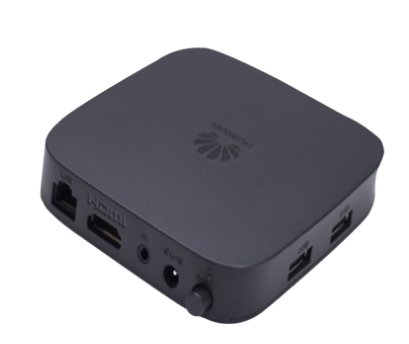
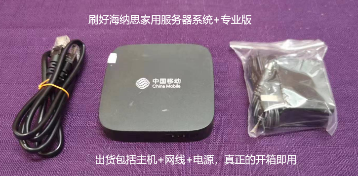
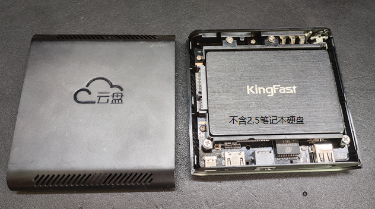
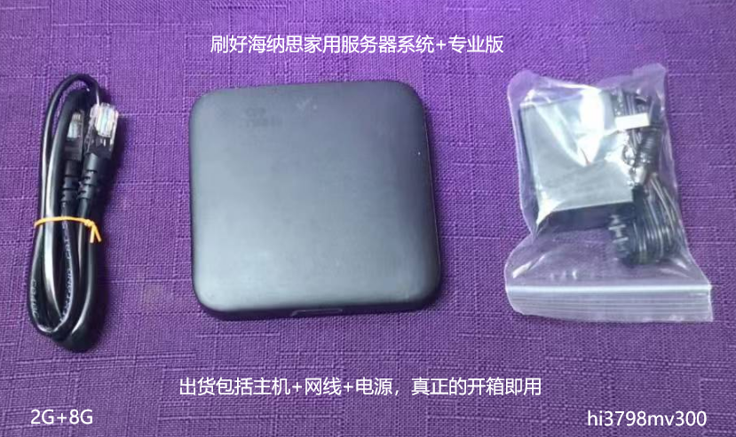

如果你刷机失败或者尚未有合适的设备，
应网友的要求，我们准备了少量的硬件，
已经刷好专业版NAS系统，欢迎选购。

## Hi3798mv100

型号：华为悦盒ec6108v9c  

芯片：海思hi3798mv100  4核1.4Hz  coremark跑分 9000-10000  

reg name : mdmo1g  
 
1G 运存 + 8G 存储  USB2.0x2 支持TF卡  

购机一律包含专业版固件，专业版详情请阅读 [社区版和专业版有什么区别？](/vippro)  

主机+电源，开箱即用。  

淘宝店地址：[https://item.taobao.com/item.htm?id=672356130441](https://item.taobao.com/item.htm?id=672356130441)

闲鱼链接：复制以下淘口令内容后打开闲鱼app  

```html
【闲鱼】https://m.tb.cn/h.5M6DsoS?tk=zBUIWguED6x CZ0001 「我在闲鱼发布了【华为机顶盒打造的Linux服务器。】」
点击链接直接打开
```

  

  


## Hi3798mv200

型号：恩兔 N2   

芯片：海思hi3798mv200  四核1.6Hz  coremark跑分 21000-22000  

reg name : mv2dmc n2ns1  
 
1G 运存 + 4G 存储 内置2.5寸sata硬盘接口 网卡千兆 USB2.0  

购机一律包含专业版固件，专业版详情请阅读 [社区版和专业版有什么区别？](/vippro)   

主机+电源，开箱即用  

  

刷机教程（售卖时已经刷好）：  
[刷机教程支持](/docs/tutorial-basics/n2-ttl-flash/)  

淘宝店地址：[https://item.taobao.com/item.htm?id=924727501777](https://item.taobao.com/item.htm?id=924727501777)


## Hi3798mv300

型号：魔百盒cm301  

芯片：海思hi3798mv300  四核1.6Hz  coremark跑分 20000-21000  

reg name : mv3dmf  
 
2G 运存 + 8G 存储  USB2.0x2 支持TF卡  

购机一律包含专业版固件，专业版详情请阅读 [社区版和专业版有什么区别？](/vippro)  

主机+电源，开箱即用。  

淘宝店地址：[https://item.taobao.com/item.htm?id=672649811159](https://item.taobao.com/item.htm?id=672649811159)

闲鱼链接：复制以下淘口令内容后打开闲鱼app  

```html
【闲鱼】https://m.tb.cn/h.5Mhag13?tk=XLfmWguz8lv CZ3457 「我在闲鱼发布了【华为海思芯片机顶盒nas系统】」
点击链接直接打开
```


  


