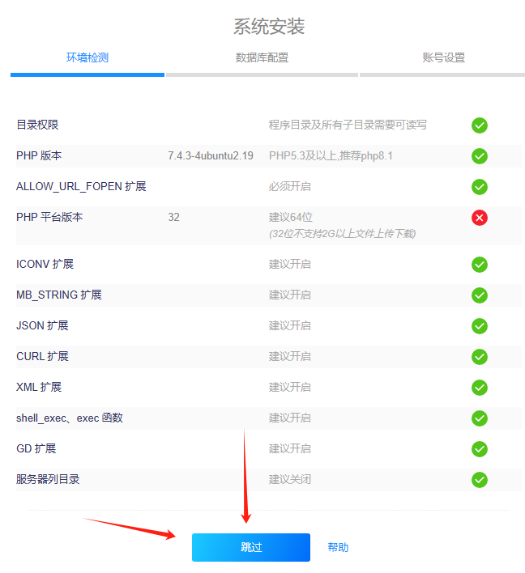
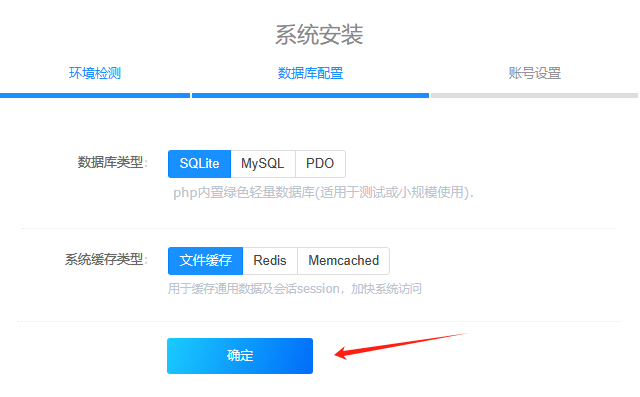
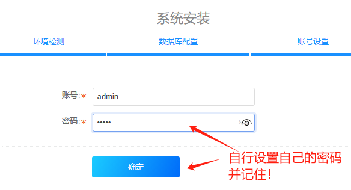
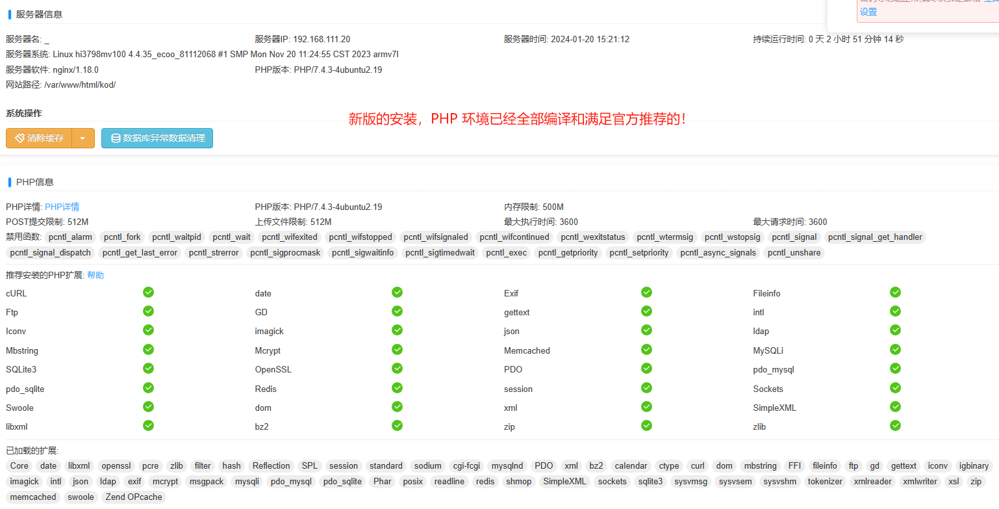
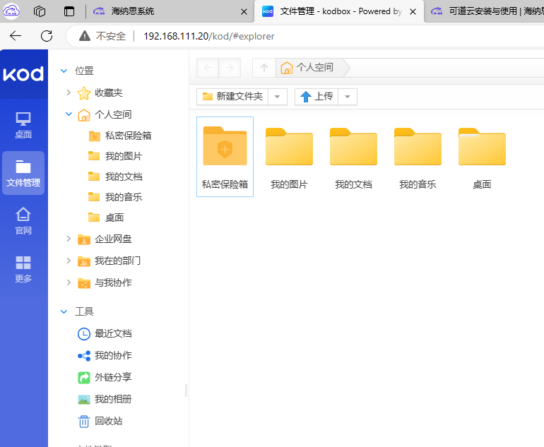

# 可道云安装与使用

海纳思系统适配了可道云的一键安装脚本，  
用户可以直接安装使用。

## 一、获取

如果你的海纳思系统发行版本是 20231201 以后的，直接以下命令安装：

```bash
histb-deb && apt upgrade -y
install-kod.sh install
```

如果是更早的版本，或者非 NAS 版本，  
则先添加海纳思的专用 apt 仓库源：

```bash
bash <(curl https://www.ecoo.top/ota.sh)
histb-deb
apt install install-kod -y
insatll-kod.sh install
```

然后刷新首页，即可看到以下图标和链接：  


或者你的 web 服务器地址+ `/kod/` 访问。

## 二、安装

安装流程很简单几步：











## 三、使用

详细的使用方法，请参看：

可道云用户使用手册 [https://docs.kodcloud.com/user/](https://docs.kodcloud.com/user/)

## 四、卸载

一句命令即可卸载：

```bash
install-kod.sh uninstall
```

注意：卸载后，php 环境保留。可以借用给其他个人程序使用。
