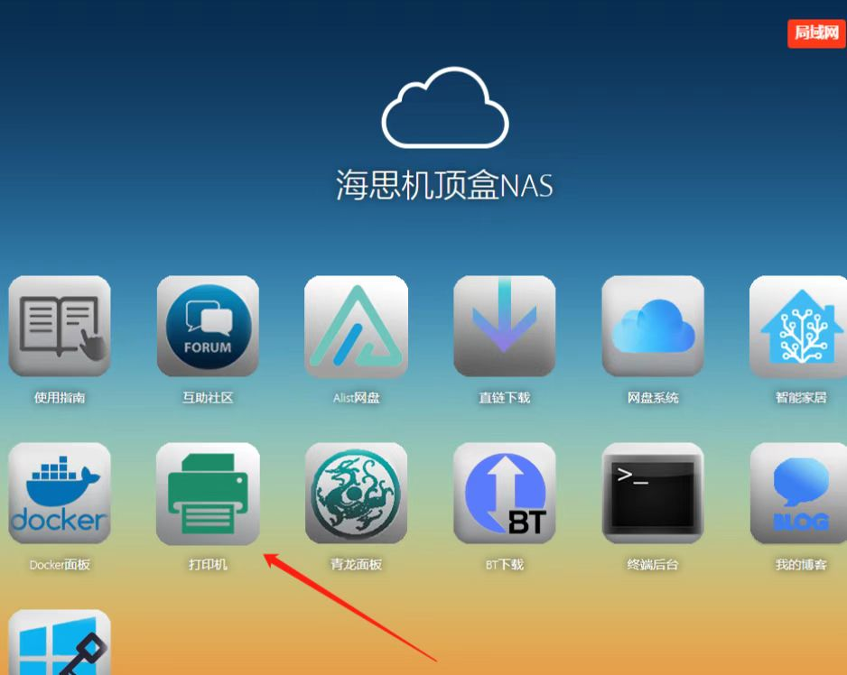
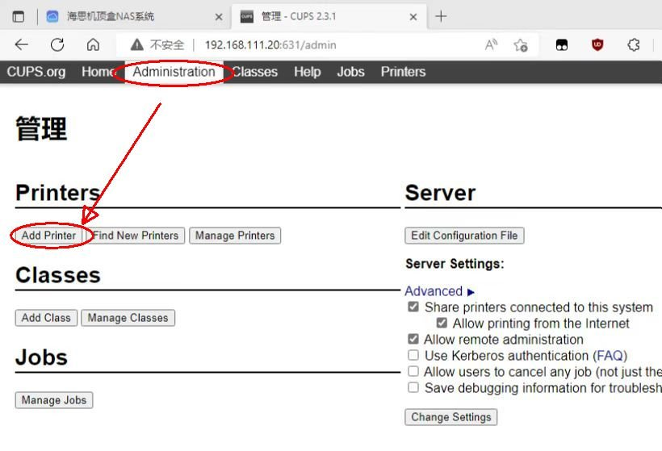
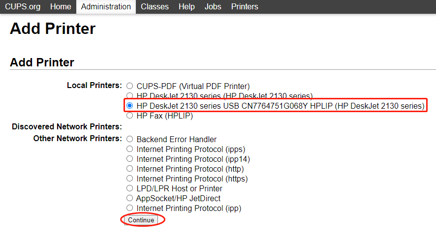
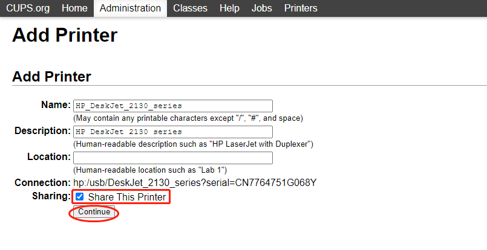
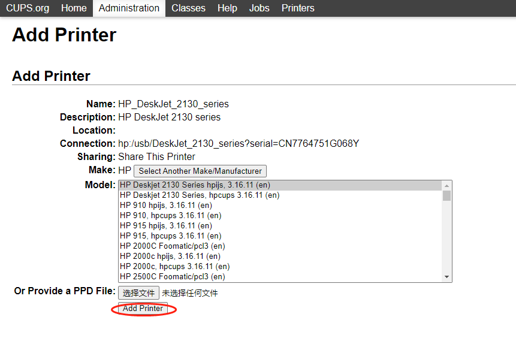
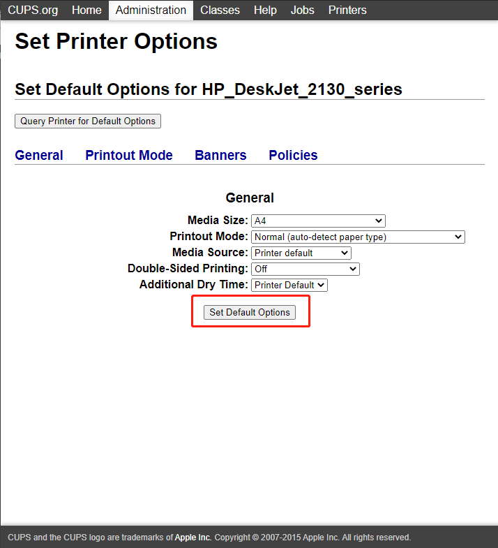
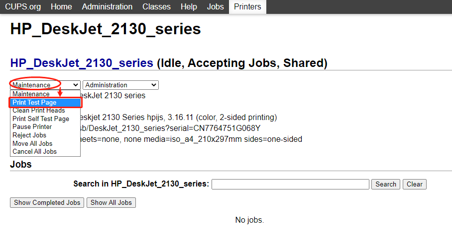
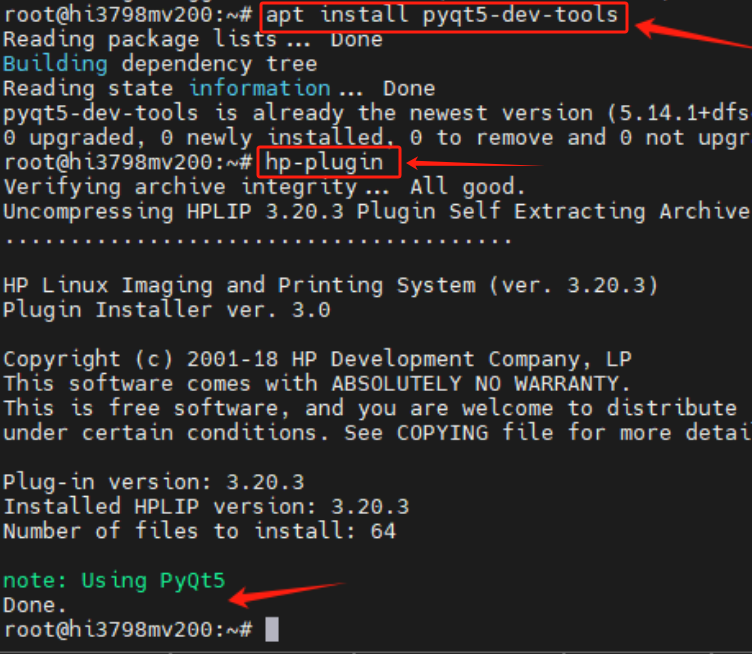

# 专业版cups打印服务器

  

## 升级专业版获取

海纳思专业版内置 Linux-cups 打印服务器程序，  
升级专业版可以获得。  

:::tip
[社区版和专业版有什么区别？](/professional)
:::

## CUPS 添加打印机教程  

### 1.连接打印机

打开打印机电源并使用数据线连接到盒子USB接口上。  

### 2.进入设置界面  

进入盒子的首页，并右上角选择局域网，点击打印机图标。  



### 3.进入管理页面  

浏览器会打开新窗口进入 CPUS 管理页面，选择 `管理` 标签然后点击 `Add Printer` 按钮进入添加打印机步骤  

用户名和密码，请填写用户名 root 和你设置的终端密码。（默认密码 ecoo1234）  

  


### 4.添加你的打印机  

点击按钮后稍等几秒，页面会刷新并列出检测到的所有可添加打印机，下面以HP2130打印机为例，  
由于惠普打印机有自己的接口协议，所以识别出来两个打印机，其实是同一个，用的协议不一样，  
如果你也是惠普打印机推荐选择带有 USB 字符的那一个，选择好之后点击 Continue 按钮  

   

接下来的页面刷新后需要填写相关信息，使用默认信息即可，  
另外需要在 Share This Printer 处的选择框打勾，然后点击 Continue 按钮  

  

然后需要选择相应的驱动程序，使用推荐的第一个即可，选择完驱动继续点击 Continue 按钮  

  

设置打印机的相关参数，一般情况默认即可，然后点击 Set Default Options 按钮完成添加操作  

   

此时打印机添加完成，建议使用测试功能打印一张测试纸来测试打印功能是否正常  




## 注意事项  

### 1.本站收集的PPD打印机驱动文件


### 2.惠普系列打印机需要许可认证

如果你的打印机是惠普系列的打印机，根据官方要求，  
首次使用需要执行一次许可认证。  

在终端中输入命令 `ubuntu` 即可。  

或者增加安装一个工具包，然后在弹出的窗口界面点击同意。  

```bash
apt update
apt install pyqt5-dev-tool
hp-plugin 
``` 


  


