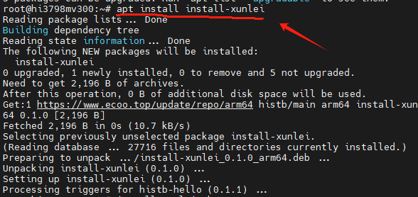
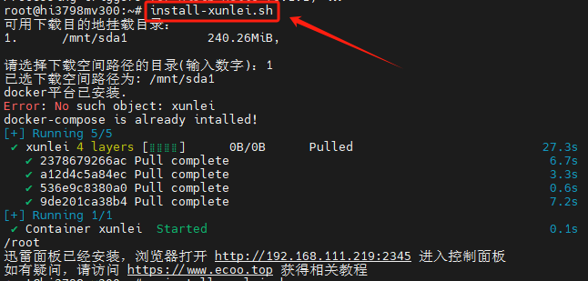
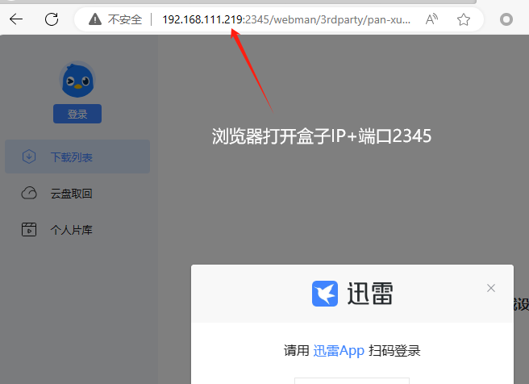
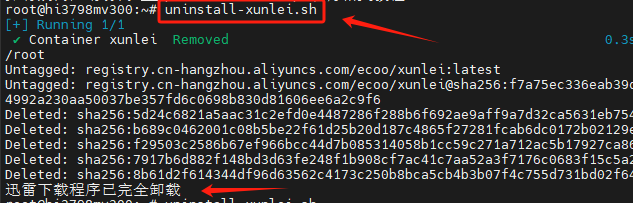

# 安装迅雷下载程序

## 64-bit 系统获取安装程序

目前仅支持 64 位的海纳思系统安装迅雷下载；

:::tip
目前 mv200, mv300 的机型均支持 64 位海纳思系统
:::

终端输入以下命令即可获取内置脚本：

```bash
sudo histb-deb
sudo apt install install-xunlei
```



## 一键安装迅雷

:::tip
你必须事先插入一个 U 盘或者 USB 硬盘或 TF 卡， 作为迅雷下载的目的地磁盘。  
并使用 format-disk.sh 将它格式化为 ext4 文件系统.  
:::

接着运行一键脚本即可安装：

```bash
sudo install-xunlei.sh
```



## 打开迅雷管理页面

迅雷管理页面端口为 `2345`

假如你的盒子 IP 地址是 `192.168.111.219`

那么迅雷管理页面就是 `http://192.168.111.219:2345`



扫码登录你的迅雷账号即可。

:::tip
迅雷下载目的地文件夹是你的挂载磁盘 `/mnt/sda1` 的 `xunleidownloads`  
迅雷配置文件位置在 `/opt/xunlei`
:::

## 一键卸载迅雷

运行一键脚本即可卸载：

```bash
sudo uninstall-xunlei.sh
```



## 备注

本程序收集于开源网络，原址在 `https://github.com/cnk3x/xunlei/` ,非官方。
