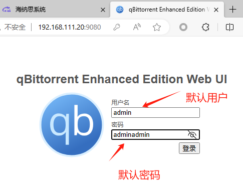
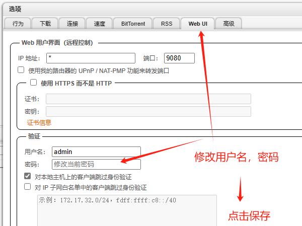
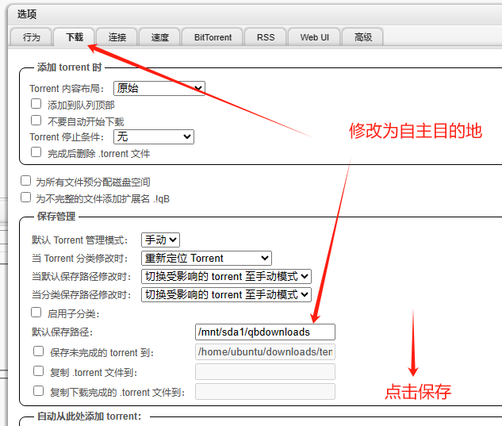
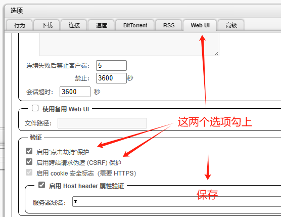
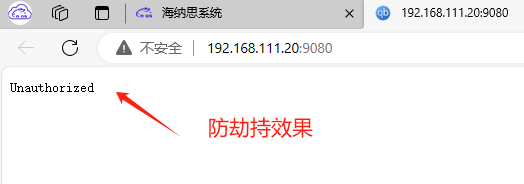

# 磁力qb下载程序

qBittorrent是一款免费的开源种子下载工具，作为µTorrent的替代品。它在所有平台上都提供相同的功能，包括Windows、Linux和macOS。该应用程序还配备了一个可扩展的搜索引擎以及WebUI遠端，以最大化你的torrent体验。使用qBittorrent，你可以在多个平台上轻松下载你喜爱的内容.    


## 获取安装程序

如果你的海纳思系统发行版本是20231201以后的，直接以下命令安装：  

```bash

apt update && apt upgrade -y

apt install qbittorrent-histb -y
```

如果是更早的版本，或者非NAS版本，  
则先添加海纳思的专用 apt 仓库源：  

```bash
bash <(curl https://www.ecoo.top/ota.sh)  

histb-deb  

apt install qbittorrent-histb -y

```

然后刷新首页，即可看到以下图标和链接：  
  

或者你的web服务器地址+ `9080` 端口访问。 

注意： 默认登录用户名 `admin`  默认密码 `adminadmin`   

注意：默认下载目的地文件夹 `/home/ubuntu/downloads` 强烈建议修改到外置磁盘空间。


## 登录



## 修改密码

 

 
## 修改下载到外置磁盘空间  

:::tip
你必须事先插入一个 U 盘或者 USB 硬盘或 TF 卡， 作为下载的目的地磁盘。  
并使用 format-disk.sh 将它格式化为 ext4 文件系统.  
:::

建立一个专用的文件夹，例如：

```
mkdir -p /mnt/sda1/qbdownloads
```

 

## 增强安全性

   
   


## 备注

本程序收集于开源网络，原址在 `https://github.com/c0re100/qBittorrent-Enhanced-Edition` 。


