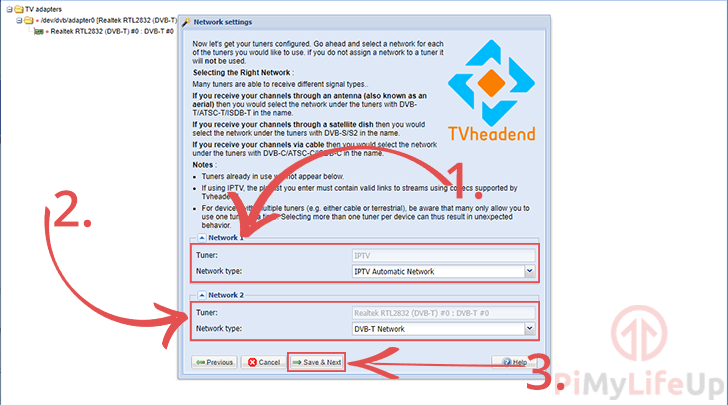
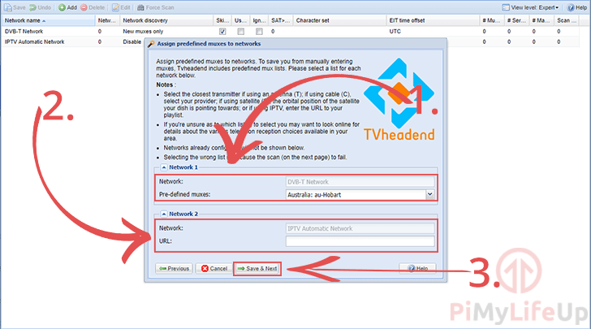
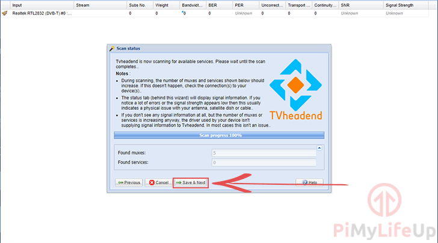
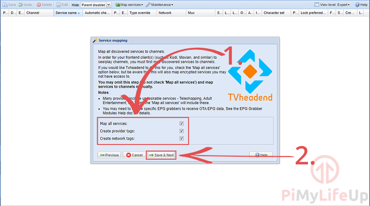
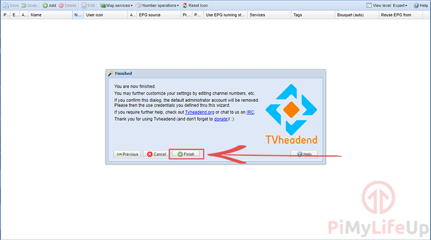

# TvHeadend 使用教程

## 安装与卸载

```shell
#更新
apt update
#注意：若是旧版本海nas-0818旧版本系统可一键添加海纳思专业apt命令：
nasupdate
histb-deb
#安装tvheadend
apt install tvheadend -y

#卸载tvheadend
apt remove tvheadend -y
```

填写用户名


填写密码


最后使用浏览器访问 http://设备 ip:9981 即可

## 使用

第一个页面要求您为网页界面(1.)和 EPG(2.)选择一种语言，你也可以选择中文 zh---因为这玩意没有中文包所以设置了也没有什么暖用

设置了这两种语言后，点击 “保存和下一步 “按钮（3.）继续。

接下来的这个页面设置额外的用户，以及添加网络限制。

1. 如果只想让 Tvheadend 能够从特定的网络范围内被访问，可以在 “允许的网络 “选项中指定它(1.)。也可以全部设置为允许所有 ip 例如：0.0.0.0/0

2. 也可以指定一个新的管理员登录。该用户将拥有与上一节中创建的用户相同的访问量。

3. 也可在 “用户登录 “中指定没有管理员权限的用户，在此页面创建用户。Ps：第三个指定用户可以空着无需设置

如果不想创建一个管理员或普通用户，请在字段中使用星号（\*）代替。

4. 完成后，点击 “保存和下一步 “按钮

现在需要为调谐器选择网络类型。



第一个可用的网络将是 IPTV 网络，在我的教程中，我将这个选项设置为 “IPTV AUtomatic 网络” (1.)

第二个可用网络应该是你的数字电视调谐器。选择 “网络类型 “到相关网络。在我这里，这被设置为 “DVB-T 网络” (2.)

一旦设置了所有可用的网络，请点击 “保存和下一步 “按钮来保存选项。

在定义了调谐器后，现在需要为它选择 muxes。



Tvheadend 软件将使用连接到家庭的调谐器来扫描指定的多路复用器的频道。你可以为每个可用的调谐器选择多路复用器(1.)。

对于 IPTV(2.)，你可以指定一个 URL (M3U 源地址) 让 Tvheadend 软件利用。填写完所有所需信息后，点击 “保存和下一步 “按钮(3.)

Tvheadend 软件现在将开始扫描多路复用器的所有可用服务。



扫描过程完成后，可以点击 “保存和下一步 “按钮。

现在将被问及如何映射 Tvheadend 检测到的服务



如果没有您想要隐藏的服务，那么可以勾选 “映射所有服务 “复选框(1.)现在可以点击 “保存和下一步 “按钮来完成设置过程。

至此，在 Raspberry Pi 上设置 Tvheadend 就大功告成了。



现在需要做的就是点击 “完成 “按钮。

接着配置方式如下：

m3u 源管理：「设定 (Configuration)」 -> 「DVB 输入 (DVB Input)」 -> 「网络 (Network)」

在这里可以新增删除编辑 m3u，编辑完要点击“Force Scan ”扫描。

管理导入的频道：「设定 (Configuration)」 -> 「DVB 输入 (DVB Input)」 -> 「服务 (Services)」

还要 Map services to channels（映射服务到频道），点击 Map services 里面的 Map all services（映射所有全部服务），播放客户端才能显示频道栏目。

测试播放：

打开 Electronic Program Guide 标签里右边的 Watch TV，打开播放窗口，选择频道测试播放效果。

[现在你就可以安心的在 kodi 等各大软件出配置了]

## 注意事项

1. 登录不进去，提示 403Forbidden？

   造成原因：安装的过程没有仔细查看提示信息并正确输入用户名和密码，导致用户名和密码验证失败。

   解决方法：使用管理终端或者文件管理器等工具，编辑文件"/var/lib/tvheadend/superuser"

   

   自行修改用户名和密码后保存（用户名和密码明文存储）

   ```shell
   #重启tvheadend
   systemctl restart tvheadend
   ```

   最后使用修改后用户名和密码登录即可
