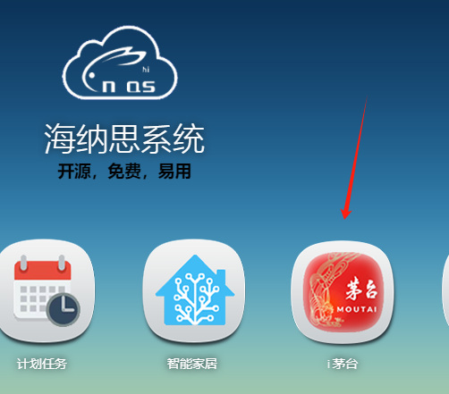
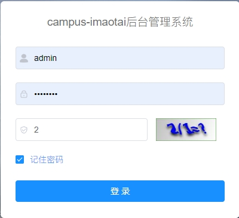
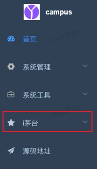
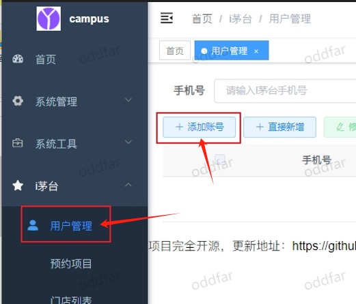
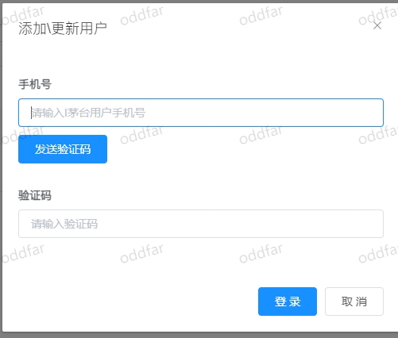
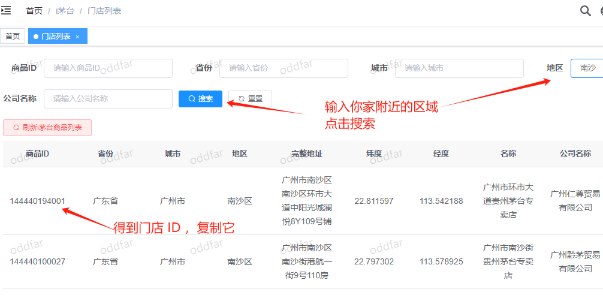
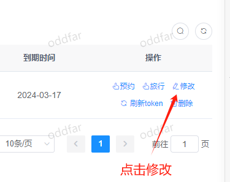
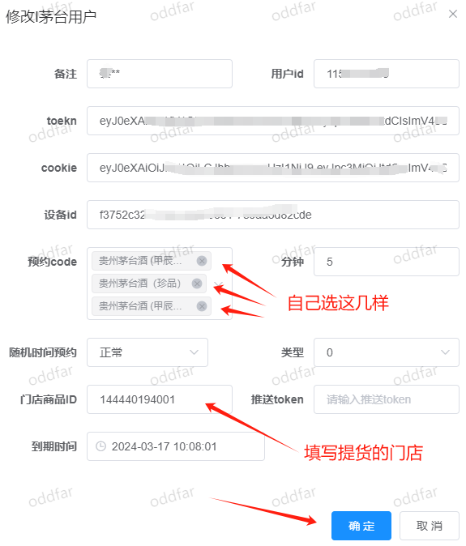

# i茅台预约程序

i茅台预约程序是github上的开源项目，  
本站将项目的安装包定制适配到海纳思系统。  
采用的程序包含 `mysql redis java` 3项，运行后约占用 200M + 运存。  
建议自行斟酌使用。  

:::caution
注意：仅提供专业版系统才可安装！非专业版请勿安装，否则安装过程失败，将需要执行purge软件包的操作。  
:::

## 一、安装与卸载

- 安装

```shell
histb-deb

apt install imaotai-histb -y
```
- 卸载

```shell
apt remove imaotai-histb
```

安装完成后访问 `http://IP:9999` 即可

## 二、使用方法

### 1.手机下载安装 i茅台 app

在手机应用商店搜索并下载安装 `i茅台` app  

注册和登录贵州茅台集团的官方 i茅台 程序，领取数字身份证。  

  
  
 
### 2.登录预约程序  

打开海纳思系统i茅台预约程序图标链接地址：  

  

默认管理员(登录后自行修改)  

账号: `admin` 密码: `admin123`  

  

### 3.选择 i 茅台模块

  

### 4.选择用户管理添加账号

  


### 5.查询你所在城市的门店的 ID 

  

### 6.填写你的信息并开始预约

  
  

### 7.在日志查看

点击预约按钮，会即时上报一次预约，并返回信息。
点击旅行按钮，会即时做一次旅行，并返回信息。


