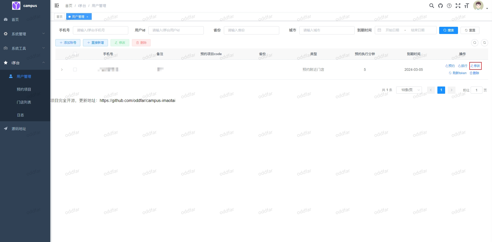
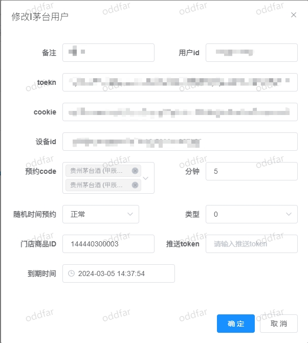

# imaotai 使用教程

注意：只有专业版才可安装！

## 安装与卸载

```shell

# 安装

apt install imaotai-histb -y

#卸载

apt remove imaotai-histb
```

安装完成后访问 http://设备 IP:9999 即可

默认管理员(登录后自行修改)

账号:admin 密码:admin123


选择 i 茅台模块


选择用户管理添加账号


先使用 i 茅台 app 注册登录，将注册好的手机号填写到下方登录


登录后点击账号右侧的修改



根据自己需要进行设置,需自行到门店列表中查询要预定的商品 ID


