# 小雅安装教程

制作一键安装小雅到系统的脚本，海纳思系统用户轻松上手。


## 一、准备工作

### 1.手机下载安装阿里云盘 APP

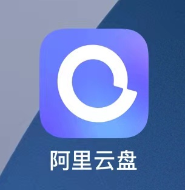  
 
	[参加阿里云盘达人招募计划，有机会获得50T容量，点击我立即报名参加！](https://pages.aliyundrive.com/mobile-page/web/signup.html?code=c5dd55f)

### 2、注册登录阿里云盘


### 3、电脑浏览器打开阿里云盘官网

[点击此处前往登录](https://www.alipan.com/)

### 4、使用手机上的阿里云盘 App 扫码登录

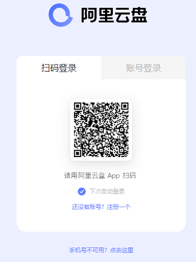

### 5、创建小雅缓存的文件夹

文件名可以自行定义，注意不能使用 `备份盘`  ，必须使用 `资源库`   

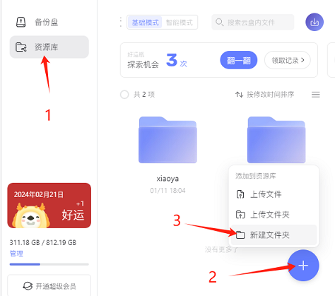

### 6、获取所需的 folderId

获得转存文件夹参数 folderId，将这串数字复制保存。  

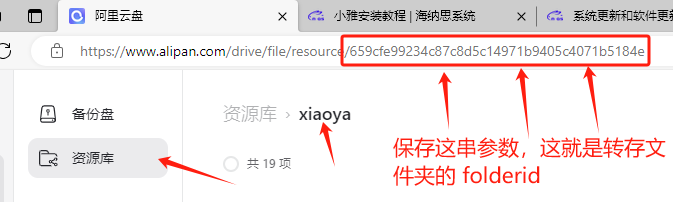

### 7、获取 refreshToken（32 位长）

访问链接扫码登录即可获取

[点击此处前往获取 refreshToken](https://csb.histb.com/)

将这串字符复制保存

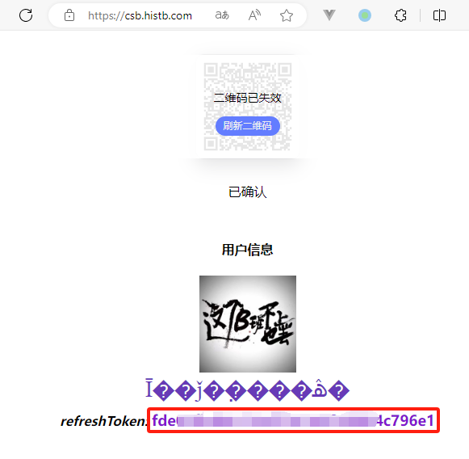

### 8、获取 token（280 位长）

[点击此处前往获取 token](https://alist.nn.ci/tool/aliyundrive/request.html)

点击按钮,生成登录二维码

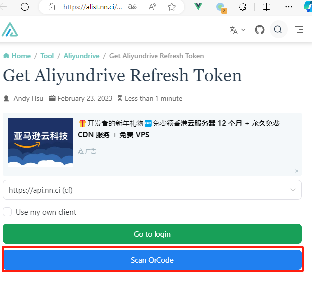

手机扫码授权

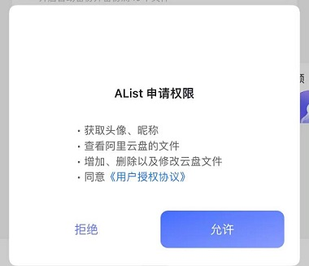

授权完成后点击按钮生成 280 位 token

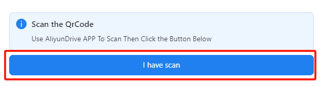

复制保存 token（280 位）

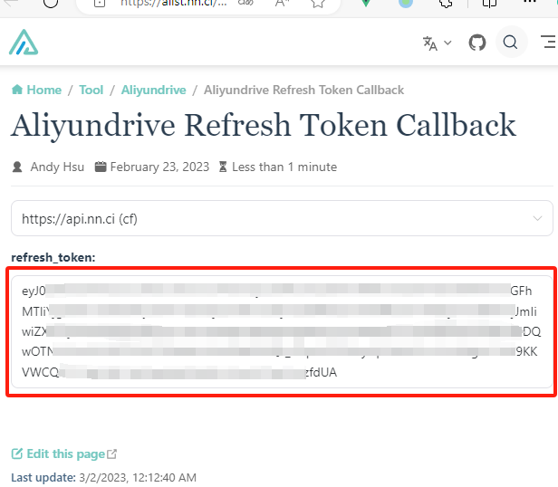

### 9、准备好了 3 个参数，开始正式安装

```shell
#执行下面的命令
bash <(curl https://ecoo.top/update/soft_init/tmp/xiaoya.sh)
```

点击回车按钮确认执行

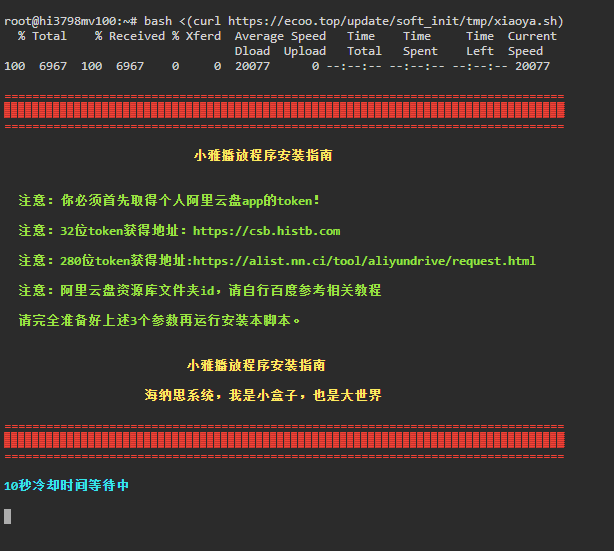

将上面 6、7、8 三个步骤获取到的参数复制粘贴，按回车确认即可完成安装

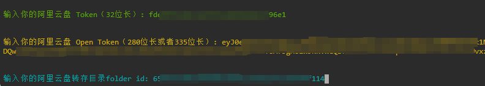

10、等待 5-10 分钟后访问 http://盒子 ip:5678,比如盒子的 ip 是 192.168.1.16 那么就访问http://192.168.1.16:5678

出现下面的情况只需静静等待几分钟后刷新页面即可

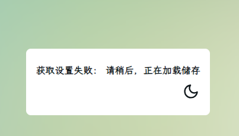

刷新后出现下面的画面即安装成功

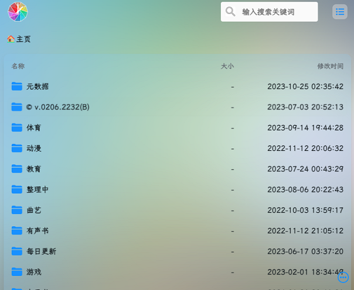

现在可以开始你的观看之旅了

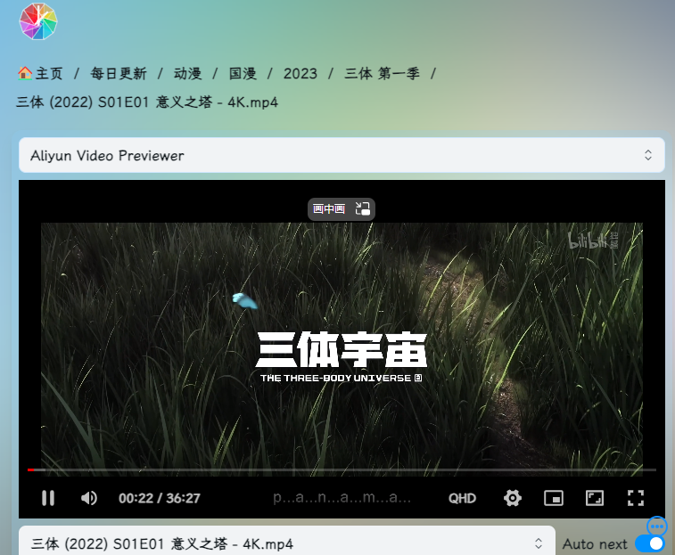
