# AdGuard Home 教程

版本：v0.102.0

内网 DNS 与 DHCP 服务，监控网络情况，拦截不良网站

## 1、安装

```shell
apt update && apt install adguard-histb
```

等待安装完成后，浏览器访问 http://盒子 IP:3000 打开 AdGuard Home 管理界面

**规则范例:**

1. 拦截 example.org 域名及其所有子域名

   ||example.org^

2. 放行 example.org 及其所有子域名

   @@||example.org^

3. AdGuard Home 现在将会把 example.org（但不包括它的子域名）解析到 127.0.0.1。

   127.0.0.1 example.org

4. 只是一条注释

   ! 这是一行注释

   \# 这也是一行注释

5. 阻止访问与 example_regex_meaning 匹配的域

   /REGEX/

6. [更多规则点击此处前往学习](https://github.com/AdguardTeam/AdGuardHome/wiki/Hosts-Blocklists)

## 2、设置网站黑名单

创建规则文件  


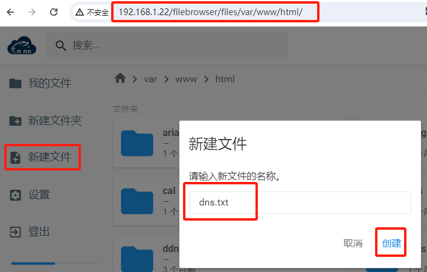


编辑内容，比如要拦截百度  


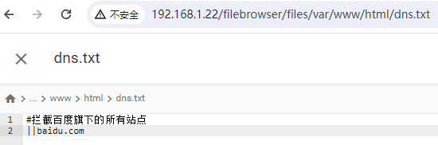


设置封锁清单  


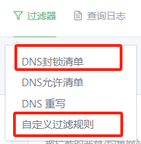


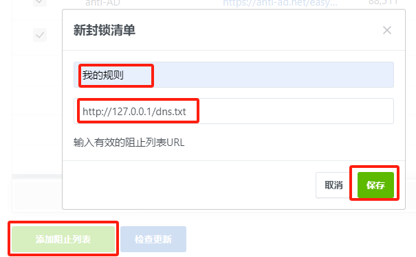


检测配置是否生效  


进入自定义过滤规则，划到最下方  


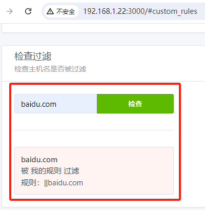


如果需要过滤的域名较少，可以直接使用自定义过滤规则来过滤，自定义过滤规则优先级最高。建议使用第一种，可以备份规则，以免丢失  


内容和上面 dns.txt 内容的规则一致  


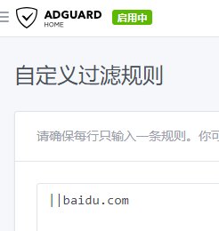


## 3、修改路由器的 DNS


将 DNS 服务器地址修改为盒子 IP，请针对自己的路由器找到相应的位置进行设置，图片仅供参考  


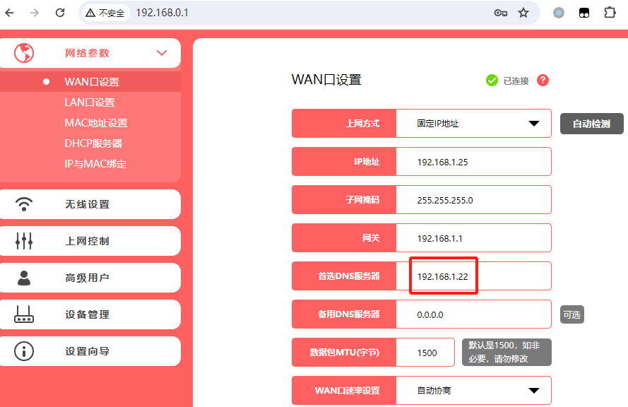


## 4、拦截效果


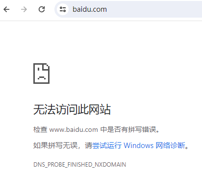


修改规则，不对 baidu.com 进行拦截  


使用“#”注释规则  


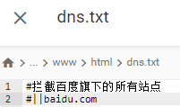


手动更新规则文件  


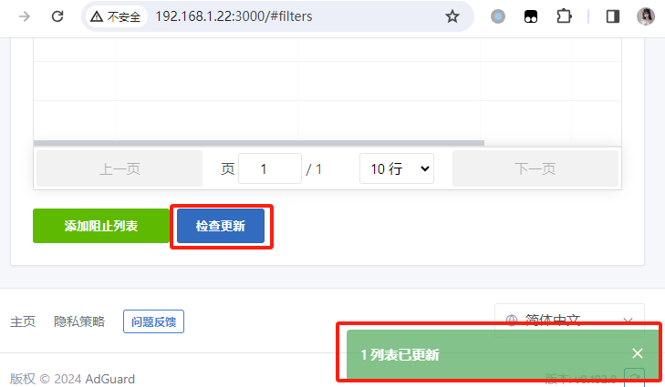


再次访问测试，成功访问  


已经不需要别的额外配置了，到这里已经完成了。  


## 5、日志查询


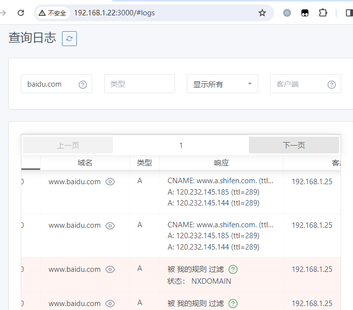


## 6、其他


AdGUARD 的开启与关闭，点击按钮切换  


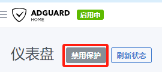


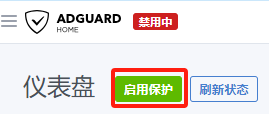


**知识点：**


1. DNS 域名解析，优先查询本设备，如无结果才会访问 DNS 服务器获取  

   

2. 执行命令 ipconfig /displaydns 可以查看 DNS 电脑的 DNS 解析记录，生存时间（单位秒）过期后才会请求 DNS 服务器  

   

   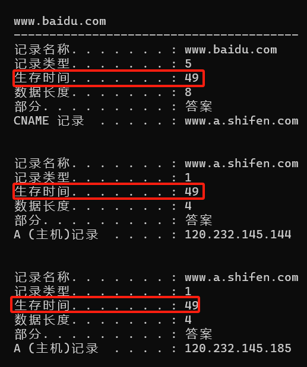

   

3. 执行命令 ipconfig /displaydns 清空记录  

   

   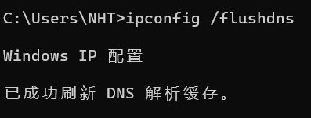
