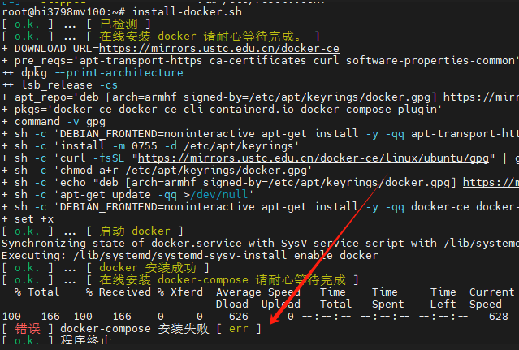

# docker 使用

### 科普名词

- 平台: docker 程序就是一个类似平台一样的程序，为了方便理解，你可以把它比喻为类虚拟机。

- 镜像：技术人员构建的各种包含了特殊环境的可以在 docker 上运行的独立子系统包。

- 容器：拉取镜像运行后，封装在一个指定的文件夹位置里的子进程。

海纳思系统内置了一键安装 docker 程序的脚本；  
直接一键命令即可安装，包含 docker-compose；  
在终端输入这个命令即可 `install-docker.sh`

## 安装 docker 平台程序

```bash
install-docker.sh
```


```consle
root@hinas:~# docker version  # 这句命令是获取 docker 平台的版本号
Client: Docker Engine - Community
 Version:           24.0.7
 API version:       1.43
 Go version:        go1.20.10
 Git commit:        afdd53b
 Built:             Thu Oct 26 09:08:47 2023
 OS/Arch:           linux/arm
 Context:           default

Server: Docker Engine - Community
 Engine:
  Version:          24.0.7
  API version:      1.43 (minimum version 1.12)
  Go version:       go1.20.10
  Git commit:       311b9ff
  Built:            Thu Oct 26 09:08:47 2023
  OS/Arch:          linux/arm
  Experimental:     false
 containerd:
  Version:          1.6.26
  GitCommit:        3dd1e886e55dd695541fdcd67420c2888645a495
 runc:
  Version:          1.1.10
  GitCommit:        v1.1.10-0-g18a0cb0
 docker-init:
  Version:          0.19.0
  GitCommit:        de40ad0
```

## 拉取 docker 各种丰富的镜像

- 拉取镜像

  ```bash
  docker pull xxx/xxx
  ```

- 运行容器

  ```bash
  docker run xxx/xxx --options
  ```

- 列出运行中的容器

  ```bash
  docker ps -a
  ```

  会列出所有运行中的容器名称和 `id`


- 停止运行中的容器

  ```bash
  docker stop [ id 的前4位数]
  ```

- 删除已停止的容器

  ```bash
  docker rm [ id的前4位数字]
  ```

- 列出所有镜像

  ```bash
  docker images
  ```

- 删除已停止的镜像

  ```bash
  docker rmi [镜像id的前4位数]
  ```

## 将 docker 镜像安装到其它磁盘位置

如果你的系统空间不足，可以通过修改 docker 平台的配置文件，达到将镜像拉取并安装到其它磁盘位置。

:::caution
注意：这个配置修改，必须在安装 docker 平台后，拉取 docker 镜像前！  
注意：请确保你的磁盘稳定在线，否则将会程序错误无法访问 docker .
:::

请参考以下命令修改配置文件`/lib/systemd/system/docker.service`

```html
systemctl stop docker # 停止 Docker 服务 mkdir -p /mnt/sda1/docker # 建立文件夹
chmod 777 -R /mnt/sda1/docker # 赋予权限 vi /lib/systemd/system/docker.service #
编辑配置文件 ExecStart=/usr/bin/dockerd -H fd://
--containerd=/run/containerd/containerd.sock 插上一句 --data-root
/mnt/sda1/docker 变为如下: ExecStart=/usr/bin/dockerd --data-root
/mnt/sda1/docker -H fd:// --containerd=/run/containerd/containerd.sock systemctl
daemon-reload # 更新启动组件 systemctl start docker # 启动 docker 服务
```

参考图例：


修改完毕，重启服务后，你再执行拉取的镜像和运行的容器，就会到你指定的磁盘了。

## 扩展

海纳思系统内置了几个一键安装的脚本，非常便利。推荐需要时选择。

```bash
install-portainer.sh #中文容器管理面板
install-qinglong.sh #青龙面板
install-jellyfin.sh #电影削刮器
install-homeassistant.sh #智能家居
install-teslamate1.sh #特斯拉远控系统
```

## 常见问题

1、安装 docker-compose 安装失败



原因网络问题，修改 dns 服务器地址

```shell
# 打开配置文件
vim /etc/resolv.conf
# 在第一行的问题输入下面内容并保存退出
nameserver 114.114.114.114
# 卸载docker
hinas-clear docker
# 重新执行安装命令
install-docker.sh
```


## 附1-docker常用命令

```
#info|version
docker info       #显示docker的系统信息，包括镜像和容器的数量
docker version    #显示docker的版本信息。
#帮助命令
docker 命令 --help #帮助命令
#镜像命令
docker images #查看所有本地主机上的镜像 可以使用docker image ls代替
docker search #搜索镜像
docker pull #下载镜像 docker image pull
docker rmi #删除镜像 docker image rm
#容器命令
docker run 镜像id #新建容器并启动
docker ps 列出所有运行的容器 docker container list
docker rm 容器id #删除指定容器
	#删除所有容器
	docker rm -f $(docker ps -aq)  	 #删除所有的容器
	docker ps -a -q|xargs docker rm  #删除所有的容器
#启动和停止容器
docker start 容器id	#启动容器
docker restart 容器id	#重启容器
docker stop 容器id	#停止当前正在运行的容器
docker kill 容器id	#强制停止当前容器
#退出容器
exit 		#容器直接退出
ctrl +P +Q  #容器不停止退出 	---注意：这个很有用的操作
#其他常用命令
docker run -d 镜像名  #后台启动命令
docker logs 		#查看日志
docker top 容器id 	#查看容器中进程信息ps
docker inspect 容器id  #查看镜像的元数据
docker exec 		#进入当前容器后开启一个新的终端，可以在里面操作。（常用）
docker attach 		# 进入容器正在执行的终端
docker cp 容器id:容器内路径  主机目的路径	#从容器内拷贝到主机上
```

## 附2-docker命令大全

```
docker attach	#连接到正在运行中的容器
docker build	#使用 Dockerfile 创建镜像
docker builder	#管理builds
    docker builder prune	#清除build缓存
docker checkpoint	#管理checkpoints
    docker checkpoint create	#从正在运行的容器创建检查点
    docker checkpoint ls	#列出容器的检查点
    docker checkpoint rm	#删除指定的检查点
docker commit	#从容器创建一个新的镜像
docker config	#管理Docker配置
    docker config create	#创建配置文件
    docker config inspect	#查看配置文件信息
    docker config ls		#显示docker里已经保存得配置文件
    docker config rm		#删除配置文件
docker container	#管理容器
    docker container prune	#删除所有已停止的容器
docker context	#管理contexts
    docker context create	#创建一个上下文
    docker context export	#将上下文导出到tar或kubecconfig文件中
    docker context import	#从tar或zip文件导入上下文
    docker context inspect	#在一个或多个上下文上显示详细信息
    docker context ls		#列出上下文
    docker context rm		#删除一个或多个上下文
    docker context update	#更新
    docker context use		#设置当前docker的上下文
docker cp		#用于容器与主机之间的数据拷贝
docker create	#创建一个新的容器但不启动它
docker diff		#检查容器里文件结构的更改
docker events	#从服务器获取实时事件
docker exec		#在运行的容器中执行命令
docker export	#将文件系统作为一个tar归档文件导出到STDOUT
docker history	#查看指定镜像的创建历史
docker image	#管理镜像
    docker image inspect	#显示一个或多个镜像的元数据
    docker image ls			#列出本地镜像
    docker image prune		#删除没有使用的镜像
    docker image rm			#删除一个或多个镜像
docker images	#列出本地镜像
docker import	#从归档文件中创建镜像
docker info		#显示 Docker 系统信息，包括镜像和容器数
docker inspect	#获取容器/镜像的元数据
docker kill		#杀掉一个运行中的容器
docker load		#导入使用 docker save 命令导出的镜像
docker login	#登陆到一个Docker镜像仓库，如果未指定镜像仓库地址，默认为官方仓库 Docker Hub
docker logout	#登出一个Docker镜像仓库，如果未指定镜像仓库地址，默认为官方仓库 Docker Hub
docker logs		#获取容器的日志
docker manifest	#管理manifest(实验，不应用于生产环境)
    docker manifest annotate	#向本地镜像清单添加附加信息
    docker manifest create		#创建用于注释和推入注册表的本地清单列表
    docker manifest inspect		#显示镜像清单或清单列表
    docker manifest push		#将清单列表推入仓库
    docker manifest rm			#从本地存储中删除一个或多个清单列表
docker network	#管理网络
    docker network connect		#将容器连接到网络
    docker network create		#创建一个网络
    docker network disconnect	#断开容器的网络
    docker network inspect		#显示一个或多个网络的元数据
    docker network ls			#列出网络
    docker network prune		#删除所有没有使用的网络
    docker network rm			#删除一个或多个网络
docker node		#管理集群(swarm)节点
    docker node demote			#从群集(swarm)管理器中降级一个或多个节点
    docker node inspect			#显示一个或多个节点的元数据
    docker node ls				#列出群集(swarm)中的节点
    docker node promote			#将一个或多个节点推入到群集管理器中
    docker node ps				#列出在一个或多个节点上运行的任务，默认为当前节点
    docker node rm				#从群集(swarm)删除一个或多个节点
    docker node update			#更新一个节点
docker pause	#暂停容器中所有的进程
docker plugin	#管理插件
    docker plugin create		#从rootfs和配置创建一个插件。插件数据目录必须包含config.json和rootfs目录。
    docker plugin disable		#禁用插件
    docker plugin enable		#启用插件
    docker plugin inspect		#显示一个或多个插件的元数据
    docker plugin install		#安装一个插件
    docker plugin ls			#列出所有插件
    docker plugin push			#将插件推送到注册表
    docker plugin rm			#删除一个或多个插件
    docker plugin set			#更改插件的设置
    docker plugin upgrade		#升级现有插件
docker port		#列出指定的容器的端口映射，或者查找将PRIVATE_PORT NAT到面向公众的端口
docker ps		#列出容器
docker pull		#从镜像仓库中拉取或者更新指定镜像
docker push		#将本地的镜像上传到镜像仓库,要先登陆到镜像仓库
docker rename	#重命名容器
docker restart	#重启容器
docker rm		#删除一个或多个容器
docker rmi		#删除一个或多个镜像
docker run		#创建一个新的容器并运行一个命令
docker save		#将指定镜像保存成 tar 归档文件
docker search	#从Docker Hub查找镜像
docker secret	#管理Docker secrets
    docker secret create	#从文件或STDIN创建一个秘密作为内容
    docker secret inspect	#显示有关一个或多个秘密的详细信息
    docker secret ls		#列出秘密
    docker secret rm		#删除一个或多个秘密
docker service	#管理服务
    docker service create	#创建一个服务
    docker service inspect	#查看服务的元数据
    docker service logs		#获取服务的日志
    docker service ls		#列出服务
    docker service ps		#列出一个或多个服务的任务
    docker service rm		#删除一个或多个服务
    docker service rollback	#将更改恢复到服务的配置
    docker service scale	#缩放一个或多个复制服务
    docker service update	#更新服务
docker stack	#管理堆栈
    docker stack deploy		#部署新的堆栈或更新现有堆栈
    docker stack ls			#列出现有堆栈
    docker stack ps			#列出堆栈中的任务
    docker stack rm			#删除堆栈	
    docker stack services	#列出堆栈中的服务
docker start	#启动一个或多个已经被停止的容器
docker stats	#显示容器的实时流资源使用统计信息
docker stop		#停止一个运行中的容器
docker swarm	#管理集群(Swarm)
    docker swarm ca			#查看或旋转当前群集CA证书。此命令必须针对管理器节点
    docker swarm init		#初始化一个群集(Swarm)
    docker swarm join		#加入群集作为节点和/或管理器
    docker swarm join-token	#管理加入令牌
    docker swarm leave		#离开群集(Swarm)
    docker swarm unlock		#解锁群集(Swarm)
    docker swarm unlock-key	#管理解锁钥匙
    docker swarm update		#更新群集(Swarm)
docker system	#管理Docker
    docker system df		#显示docker磁盘使用情况
    docker system events	#从服务器获取实时事件
    docker system info		#显示系统范围的信息
    docker system prune		#删除未使用的数据
docker tag		#标记本地镜像，将其归入某一仓库
docker top		#查看容器中运行的进程信息，支持 ps 命令参数
docker trust	#管理Docker镜像的信任
    docker trust inspect	#返回有关key和签名的低级信息
    docker trust key		#管理登入Docker镜像的keys
    	docker trust key generate	#生成并加载签名密钥对
		docker trust key load		#加载私钥文件以进行签名
    docker trust revoke		#删除对镜像的认证
    docker trust sign		#镜像签名
    docker trust signer		#管理可以登录Docker镜像的实体
    	docker trust signer add		#新增一个签名者
		docker trust signer remove	#删除一个签名者
docker unpause	#恢复容器中所有的进程
docker update	#更新一个或多个容器的配置
docker version	#显示 Docker 版本信息
docker volume	#管理volumes
    docker volume create	#创建一个卷
    docker volume inspect	#显示一个或多个卷的元数据
    docker volume ls		#列出卷
    docker volume prune		#删除所有未使用的卷
    docker volume rm		#删除一个或多个卷
docker wait		#阻塞运行直到容器停止，然后打印出它的退出代码
```

