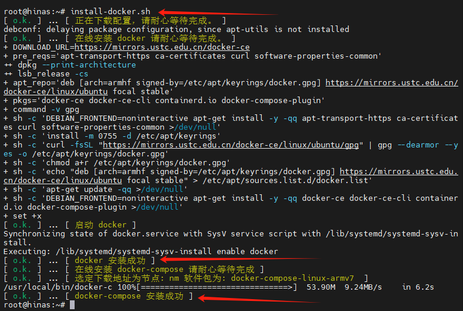
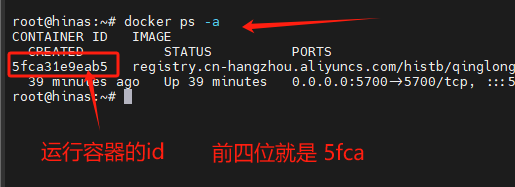
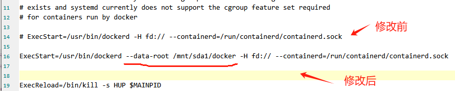

# docker 使用

### 科普名词

- 平台: docker 程序就是一个类似平台一样的程序，为了方便理解，你可以把它比喻为类虚拟机。

- 镜像：技术人员构建的各种包含了特殊环境的可以在 docker 上运行的独立子系统包。

- 容器：拉取镜像运行后，封装在一个指定的文件夹位置里的子进程。

海纳思系统内置了一键安装 docker 程序的脚本；  
直接一键命令即可安装，包含 docker-compose；  
在终端输入这个命令即可 `install-docker.sh`

## 安装 docker 平台程序

```bash
install-docker.sh
```



```consle
root@hinas:~# docker version  # 这句命令是获取 docker 平台的版本号
Client: Docker Engine - Community
 Version:           24.0.7
 API version:       1.43
 Go version:        go1.20.10
 Git commit:        afdd53b
 Built:             Thu Oct 26 09:08:47 2023
 OS/Arch:           linux/arm
 Context:           default

Server: Docker Engine - Community
 Engine:
  Version:          24.0.7
  API version:      1.43 (minimum version 1.12)
  Go version:       go1.20.10
  Git commit:       311b9ff
  Built:            Thu Oct 26 09:08:47 2023
  OS/Arch:          linux/arm
  Experimental:     false
 containerd:
  Version:          1.6.26
  GitCommit:        3dd1e886e55dd695541fdcd67420c2888645a495
 runc:
  Version:          1.1.10
  GitCommit:        v1.1.10-0-g18a0cb0
 docker-init:
  Version:          0.19.0
  GitCommit:        de40ad0
```

## 拉取 docker 各种丰富的镜像

- 拉取镜像

  ```bash
  docker pull xxx/xxx
  ```

- 运行容器

  ```bash
  docker run xxx/xxx --options
  ```

- 列出运行中的容器

  ```bash
  docker ps -a
  ```

  会列出所有运行中的容器名称和 `id`



- 停止运行中的容器

  ```bash
  docker stop [ id 的前4位数]
  ```

- 删除已停止的容器

  ```bash
  docker rm [ id的前4位数字]
  ```

- 列出所有镜像

  ```bash
  docker images
  ```

- 删除已停止的镜像

  ```bash
  docker rmi [镜像id的前4位数]
  ```

## 将 docker 镜像安装到其它磁盘位置

如果你的系统空间不足，可以通过修改 docker 平台的配置文件，达到将镜像拉取并安装到其它磁盘位置。

:::caution
注意：这个配置修改，必须在安装 docker 平台后，拉取 docker 镜像前！  
注意：请确保你的磁盘稳定在线，否则将会程序错误无法访问 docker .
:::

请参考以下命令修改配置文件`/lib/systemd/system/docker.service`

```html
systemctl stop docker # 停止 Docker 服务 mkdir -p /mnt/sda1/docker # 建立文件夹
chmod 777 -R /mnt/sda1/docker # 赋予权限 vi /lib/systemd/system/docker.service #
编辑配置文件 ExecStart=/usr/bin/dockerd -H fd://
--containerd=/run/containerd/containerd.sock 插上一句 --data-root
/mnt/sda1/docker 变为如下: ExecStart=/usr/bin/dockerd --data-root
/mnt/sda1/docker -H fd:// --containerd=/run/containerd/containerd.sock systemctl
daemon-reload # 更新启动组件 systemctl start docker # 启动 docker 服务
```

参考图例：


修改完毕，重启服务后，你再执行拉取的镜像和运行的容器，就会到你指定的磁盘了。

## 扩展

海纳思系统内置了几个一键安装的脚本，非常便利。推荐需要时选择。

```bash
install-portainer.sh #中文容器管理面板
install-qinglong.sh #青龙面板
install-jellyfin.sh #电影削刮器
install-homeassistant.sh #智能家居
install-teslamate1.sh #特斯拉远控系统
```

## 常见问题

1、安装 docker-compose 安装失败

原因网络问题，修改 dns 服务器地址

```shell
# 打开配置文件
vim /etc/resolv.conf
# 在第一行的问题输入下面内容并保存退出
nameserver 114.114.114.114
# 卸载docker
hinas-clear docker
# 重新执行安装命令
install-docker.sh
```
