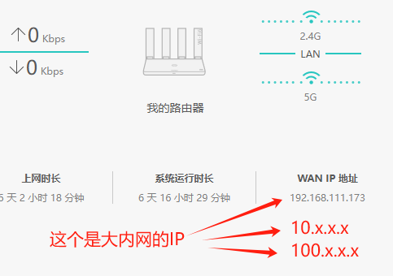
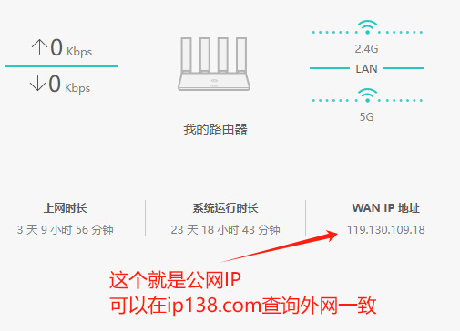

# 外网访问家里的 HiNas

## 常识科普

### 外网(公网)、内网的区别

外网（公网）指全球互联网，任何设备均可接入，IP地址全球唯一，用于跨网络通信。内网指局域网（LAN），局限于特定区域（如家庭、公司），设备通过路由器连接，IP地址可重复，仅在内部通信，需通过网关访问外网。  

### 运营商是否提供公网IP：

几乎所有运营商都默认不再提供公网IPv4，部分高级网络套餐包含公网IPv4提供除外，请自行确认你的网络是否分配公网IP。  
进入你的光猫管理页面可以查询，例如：  
  
  

## 实现外网访问

### 1、VPN

当网络一方拥有固定的公网 IP 时，使用该技术可以允许其他没有固定公网 ip 的网络设备，允许使用 VPN 连接到该网络，实现外网访问内网设备。（这里不做展开）

### 2、动态域名解析 DDNS

当网络一方拥有随机的公网 IP 时，可以使用该技术将动态变化的 IPv4 地址和固定的域名绑定，访问固定的域名可以访问到相应的网络，亦可以使用上述的 VPN 技术使用外网访问内网设备。  
[DDNS-Go 教程](https://ecoo.top/docs/nas-skill/ddnsgo)

### 3、端口映射

在上述两种情况的前提下，可以搭配端口映射，将想要开放公网访问的服务开放到公网，允许公网设备访问该服务，如百度等网站服务。  
端口映射可在光猫实现单层端口映射，如果光猫改成了桥接后可以在路由器上实现单层端口映射。亦或者可以配置多层端口映射，即光猫和路由器同时配置。  
关键点在于，配置 tcp/udp 端口，指定外网访问端口，内网服务端口和内网服务的主机 IP。

### 4、内网穿透 frp

frpc，是 frp client 的缩写，即 frp 客服端。既然有客户端，那么就会有所谓的服务端 frps(frp server)。  
frp 实现内网穿透的原理，可以简单理解为中间人（frps）传递消息。  
开通 frpc 服务后，frpc 会自动连接到 frps。  
每次你要访问 frpc(你的 hinas)时，因为 frps 是处于公网上的，你可以随时访问到。因此 frps 会将你的信息传递给已经建立好连接的 frpc 上，并将从 frpc 接收的信息转发给你，从而实现内网穿透。  
[frpc 教程](https://www.ecoo.top/docs/nas-skill/frpc)
