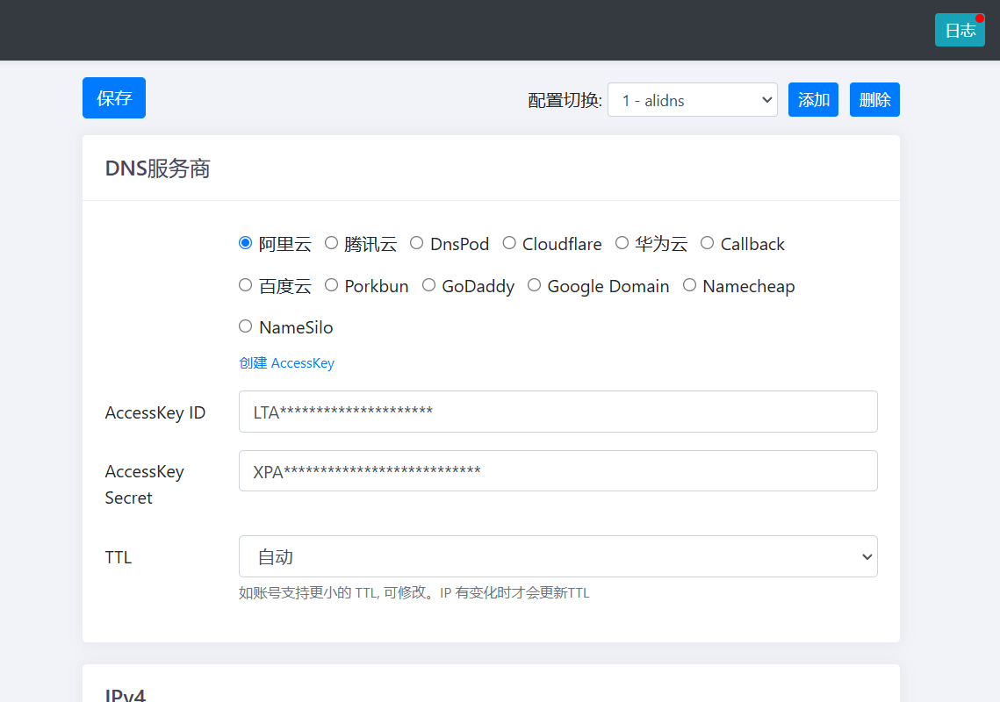

# DDNS-GO

动态域名解析

## 安装（docker 版本）

需要先安装 docker，没有安装的可以点击跳转[docker 安装使用教程](https://ecoo.top/docs/nas-skill/docker)

```bash
#host模式, 同时支持IPv4/IPv6, Liunx系统推荐
docker run -d --name ddns-go --restart=always --net=host jeessy/ddns-go
#桥接模式, 只支持IPv4, Mac/Windows系统推荐
docker run -d --name ddns-go --restart=always -p 9876:9876 jeessy/ddns-go

```

等待命令执行完毕，在浏览器中打开 http://主机 IP:9876



根据你的域名提供商进行相应的配置，注意，只有在你有公网 IP（IPv4/IPv6）时，配置的域名才能有效访问。

更多内容可以点击查看海思论坛帖子[域名动态解析 ddns-go 公网 IPv4 或 IPv6 地址 Docker 版](https://bbs.histb.com/d/979-yu-ming-dong-tai-jie-xi-ddns-gogong-wang-ipv4huo-ipv6di-zhi-dockerban)
后者点击查看[ddns-go 的 github 官网](https://github.com/jeessy2/ddns-go)
