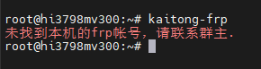
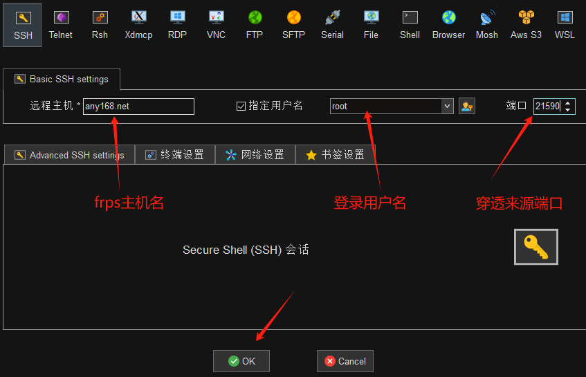
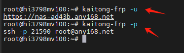
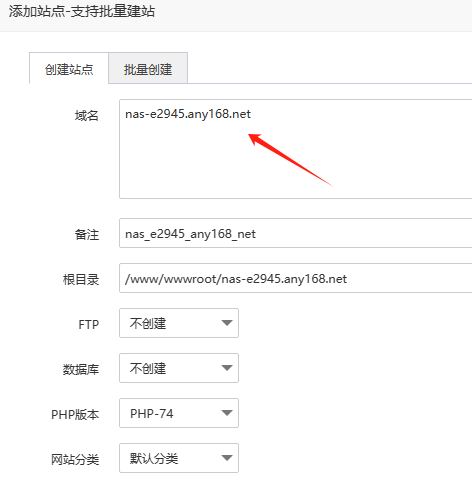
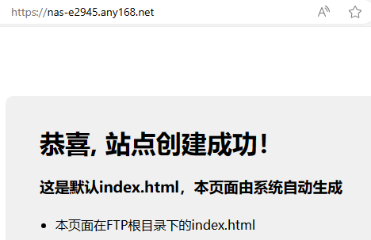

# 内网穿透

内网穿透，就是无论你的盒子所处网络是否有公网IP，无论是否在复杂内部网络下，只要你的盒子能联通上网，就可以做好穿透，让你在异地随时访问和管理海纳思系统。

## 系统内置 frpc

海纳思系统（hinas）内置了一个frpc的穿透客户端软件，  
但是并没有开启，也没有运行。  
终端输入 ```frpc -v``` 可以看到它的版本号  
终端输入 ```systemctl enable frpc``` 可以设置为开机自启动  
终端输入 ```systemctl start frpc``` 可以运行它  
终端输入 ```systemctl status frpc``` 可以查看它运行后的状态是否正确  
如果你不喜欢，可以完全删除它  

```bash
sudo apt purge frpc-histb
```

当然，如果你哪天又想用了，就安装

```bash
sudo apt update && sudo apt install frpc-histb
sudo reboot
#重新安装可能需要重启系统
```

:::tip
FRP软件的的官方教程：[FRP官方教程网站](https://gofrp.org/zh-cn/docs/)
:::


## 开通 frpc 账号

如果你没有自己搭建的 frps 服务器，可以捐赠 25 元1年，使用作者搭建的。

未开通前：终端输入 `kaitong-frp`  

  

将你的设备识别码发给作者，捐赠后，继续输入 `kaitong-frp` 即可开通。


## 手动配置案例

如果你开通的是作者的 frpc 账号，首次使用是默认穿透 22 端口和 web 程序的 443 端口。

配置文件位置： `/etc/frp/frpc.toml`

此时，你可以使用两个基本功能：  

### 1. 远程 ssh 访问盒子终端后台 

```bash
ssh -p xxxxx root@any168.net
```

xxxxx 是指随机分配给你账号的 frps 服务器端口。

配置的模块示例：

```bash
...#前面的是账号信息（不可泄露）

[[proxies]]
name = "ssh-21590"
type = "tcp"
localIP = "127.0.0.1"
localPort = 22
remotePort = 21590

#这里的21590端口就是直达你的盒子的网路
```

:::caution
从上面的配置可以看出来，一旦你开通了frpc账号，别人就可以从扫描作者的frps服务器端口，进而入侵你的盒子。  
开通后，你的22端口就会通过frps的21590暴露在互联网上。  
所以：请务必更改你的后台密码为高强度密码！  
这个非常重要。修改密码教程看这里：[开始使用-密码修改](/docs/tutorial-extras/start#修改密码)
:::

客户端远程登录示例：21590端口是一个例子，请填写你的盒子实际分配的端口。  


### 2.远程访问你的盒子首页

开通后，会默认分配一个域名到你的盒子首页：

这个域名可以直达你的盒子首页外网的程序。相当于你的盒子首页就是一个公开的网站。

你可以在 `使用说明` 里找到这个域名；或者终端输入 `kaitong-frp -u` 显示出来。



:::tip
无论你重置系统或者重新刷机，海思芯片的机顶盒，账号是绑定cpu的，(S805盒子重置系统也不会变)  
都可以在终端输入 `nasupdate` 然后输入 `kaitong-frp` 命令复通。
:::

注意：一个穿透的域名对应一个穿透的端口。

配置文件里的穿透模块示例 (https)：  

```bash
[[proxies]]
name = "wodemingzijiaozuozhangsan"
type = "https"
subdomain = "nas-zhangsan"
#如果你有自己的域名,可以同时打开这行,你的域名要解析到frps服务器
#customDomains = ["www.yourdomain.com"]
[proxies.plugin]
type = "https2http"
localAddr = "127.0.0.1:80"
#如果使用自己的域名,请自行制作你的SSL替换到下面文件位置
crtPath = "/etc/frp/yourdomain.crt"
keyPath = "/etc/frp/yourdomain.key"
requestHeaders.set.x-from-where = "frp"
```


### 3.增加穿透访问其他端口的程序(http)

你可以通过修改 `/etc/frp/frpc.toml` 配置文件，增加你需要的穿透。

这里举两个例子：  

1.穿透盒子的 `青龙面板` 程序5700端口(用默认any168.net域名)  

```bash
[[proxies]]
name = "zhangsandeqinglong"
type = "http"
localPort = 5700
subdomain = "zhangsandeqinglong"
```

这样你就可以访问域名直达你的青龙面板程序了： `http://zhangsandeqinglong.any168.net`    
注意，只需要填写子域名，这个子域名你可以自己定义，不能跟他人重复。  


2.穿透盒子的 `青龙面板` 程序5700端口(用自己的个人域名)

```bash
[[proxies]]
name = "zhangsandeqinglong"
type = "http"
localPort = 5700
customDomains = ["ql.yourdomain.com"]
```


你的个人域名需要解析到any168.net的IP。终端输入 `nslookup any168.net` 可以获得服务器IP。    

这样你就可以访问域名直达你的青龙面板程序了： `http://ql.yourdomain.com` 

注意：修改配置后，需要运行重启 frpc 服务命令

```bash
systemctl restart frpc
```


### 4.增加穿透访问其他端口的程序(https)

```bash
[[proxies]]
name = "wodemingzijiaozuozhangsan"
type = "https"
subdomain = "zhangsandeqinglong"
[proxies.plugin]
type = "https2http"
localAddr = "127.0.0.1:5700"
crtPath = "/etc/frp/frpc.crt"
keyPath = "/etc/frp/frpc.key"
requestHeaders.set.x-from-where = "frp"
```

这样你就可以访问域名直达你的青龙面板程序了： `https://zhangsandeqinglong.any168.net` 

注意：修改配置后，需要运行重启 frpc 服务命令

```bash
systemctl restart frpc
```


## 注意事项

检查自己修改的配置是否成功(多人使用, 只能使用唯一的xxx名称):   
```bash
systemctl stop frpc			#先停止frp客户端的服务
frpc -c /etc/frp/frpc.toml		#试运行上面修改过的配置
#最后, 如果出现的都是蓝色的并且都显示success的结果, 则ok,
#否则重新修改xxx的名称避免和其他人的设置重复
#按ctrl+c结束命令
systemctl restart frpc		#重启服务
```

## 拓展 （机智的用法）

如果你使用的是 [宝塔专用固件](/baota.html)，你就可以轻松搭建自己的站点。   

第一步： `kaitong-frp` 获得穿透分配的域名；   

第二步：使用这个域名建站；  

  

第三步：设置为默认站点；  
第四步：我就建个站：  




