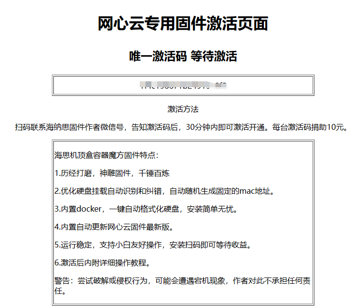

# 网心云安装与使用

已经很多群友在安装使用，群主测试机每天都有可接受的收益幅度。

[](https://act.walk-live.com/acts/invite/v3/?inviteid=cb9bbacd)

**点击上面链接注册网心云即可获得 5 元奖励**

## 1.安装

以下两种方案安装：

### 方法一：脚本一键切换安装

**注意：在激活之前，无法进入终端，执行下面命令前请慎重考虑**

网心云专用固件和海纳思社区版固件互相切换脚本命令 mv100

```shell
bash <(curl https://ecoo.top/mv100-wx.sh)
```

网心云专用固件和海纳思社区版固件互相切换脚本命令 mv200/300

```shell
bash <(curl https://ecoo.top/mv23-wx.sh)
```

注意：网心云专用固件只适配在海思 cpu 机型盒子刷入，不支持 s805 玩客云。

注意：你必须先刷好社区版的海纳思系统，再运行一键切换。

注意：网心云专用固件是纯净版系统，优化了跑容器魔方的配置。

注意：一键切换后请务必等待 10 分钟系统初始化，之前不可做任何操作。

切换后到路由器重新找自动分配的 IP ，浏览器打开首页，发激活码给群主激活。

### 方法二：刷机包刷机

暂未放出刷机包

## 2.激活

浏览器访问设备 ip 首页，复制位于中间的一串长度 20 位的字符（设备码），发送给群主激活  
在激活之前，无法进入终端



## 3.使用

激活系统后，刷新首页。打开管理终端（浏览器访问，http://设备 ip:7681）即可进入终端进行安装，初始用户名 root，密码 ecoo1234，首次进入务必修改为强密码。

插入一个硬盘，建议 240G 以上机械或固态硬盘

```shell
#执行下面命令将硬盘一键格式化为ext4文件系统格式
1-autofdisk.sh
#输入df检查是否磁盘容量相符，若不相符，可重复运行命令再次格式化。
df -h
#输入命令一键安装网心云镜像,安装完成后，即可打开18888端口网页进行扫码绑定和添加管理业务。
2-install-onething.sh

#自由选择业务模板，您只能选择其中一种模式添加
#添加默认 10 个业务需要 512G 以上硬盘空间
task 500
#添加默认 240G 以上磁盘空间的业务
task 240
#添加 4 个 CG 业务，硬盘空间需求至少 60G
task 4cg
#添加 4 个 CZ 业务，硬盘空间需求至少 210G
task 4cz
#添加 1 个 CG 业务 3 个 CZ 业务，硬盘空间需求至少 160G
task 1g3z
#添加所有业务各一个，硬盘空间需求至少 512G
task 501
#添加 CB,CZ,CX,CG 业务各一个，硬盘空间需求至少 210G
task 502
```

## 注意事项

- 1. 遇到特殊情形重置系统后，每台机可以免费激活 3 次机会，将重置后的激活码告知作者即可。
- 2. 如果执行了第一个脚本格式化硬盘后，发现硬盘依然没有挂载到/mnt/disk 的情形，  
     请检查易驱线或者硬盘盒的问题。已经证明过有部分易驱线不能很好支持硬盘在 Linux 下的使用，  
     会出现只能读取，无法写入的情况。更换掉就好了。
- 3. 运行第一个脚本后，务必用 df -h 命令检查是否挂载上，是否出现 /mnt/disk，容量是否相符。  
     如果不符，或者没有出现 " sda1 已经挂载，准备好了" 的返回信息，请再次运行第一个脚本命令。  
     或者检查可能出现第 3 的问题与否。
- 4. 已经默认使用国内镜像拉取的 163 源，第二个脚本运行后，请检查是否完全拉取成功。
- 5. 拉取成功后，打开 18888 端口网页即可看到信息，检查是否最新版本。  
     网心云镜像最新版本号的在 hub.docker.com 可以看到。  
     已经内置自动升级的配置，会跟随官方同步升级，无需干预。  
     遇到官方升级镜像的当日，收益可能有波动，但不影响正常收益，可以忽略。
- 6. 群主 “网心云专用固件” 202301 新版本支持自主添加业务模板（目前只有 7 个模板）  
     1，2 号脚本运行安装完成后， 使用方法：  
     输入 task 500 添加默认 10 个业务需要 512G 以上硬盘空间  
     输入 task 240 添加默认 240G 以上磁盘空间的业务  
     输入 task 4cg 添加 4 个 CG 业务，硬盘空间需求至少 60G  
     输入 task 4cz 添加 4 个 CZ 业务，硬盘空间需求至少 210G  
     输入 task 1g3z 添加 1 个 CG 业务 3 个 CZ 业务，硬盘空间需求至少 160G  
     输入 task 501 添加所有业务各一个，硬盘空间需求至少 512G  
     输入 task 502 添加 CB,CZ,CX,CG 业务各一个，硬盘空间需求至少 210G  
     注意：您只能选择其中一种模式添加

已添加多业务榨干模式，20 分钟后检查业务情况是否正常启动即可。  
扫二维码码绑定网心云 app 才能看到收益。

- 7. 远程终端获取 18888 页面信息，比如扫码信息，可以在终端输入 wxyinfo.sh 获得绑定 app 的二维码

- 8. 已经内置很多优化脚本，包括异常断电重启后磁盘的检测并恢复。但不包括特殊情形。  
     若遇到特殊情形下无法挂载硬盘，可以尝试手动进行恢复：

  ```shell
  systemctl stop docker
  umount /mnt/disk
  fsck /dev/sda1
  mount /dev/sda1 /mnt/disk
  systemctl start docker
  ```

- 9. 如果发现业务异常或者收益低于 3 毛钱，建议检查硬盘是否正常读写。或重新格式化硬盘挽救一次：  
     更换硬盘或者重新格式化硬盘教程：

  ```shell
  docker stop wxedge
  docker rm wxedge
  docker stop watchtower
  docker rm watchtower
  docker rmi registry.cn-hangzhou.aliyuncs.com/histb/onething
  ```

然后依次运行 1，2 号脚本即可。

安装完成后，终端输入 task 500 即可添加 500G 硬盘空间的榨干模式。  
重新格式化硬盘后，需要重新扫码绑定 app。

- 10. 请保持长期 24 小时在线，尽可能保证不要断电。断电的情形，可能造成磁盘损伤中断挂载。

- 11. 尽可能去阅读学习网心云官方的资料，包括如何停止，删除，拉取 docker 镜像，保存 wxnode 文件。  
      遇到状况时，自己可以动手修复。  
      （本固件的 wxnode 位置在：/mnt/disk/onething/storage/wxnode ）

网心云官方资料介绍地址：https://help.onethingcloud.com/caa9/a0fe/b6b3

- 12. 更多的知识交流，请到社区去发帖求助或者互相指导。

- 13. 重启设备后，网心云设备 SN 变化

  由于硬盘挂载速度比 docker 容器启动快导致

  ```shell
  #编辑docker服务文件
  sudo vim /lib/systemd/system/docker.service
  ```

  找到下面这行

  ```console
  ExecStart=/usr/bin/dockerd -H fd:// --containerd=/run/containerd/containerd.sock
  ```

  在这一行增加以下内容，保存退出

  ```console
  ExecStart=/usr/bin/dockerd -H fd:// --containerd=/run/containerd/containerd.sock
  ExecStartPre=/bin/sleep 30
  ```

  重载加载 systemd 管理的服务配置

  ```shell
  sudo systemctl daemon-reload
  ```

  重启 Docker 服务以应用更改

  ```shell
  sudo systemctl restart docker
  ```

**免责声明：本固件只对海思机顶盒做了最完善地优化运行网心云容器魔方， 由于收益高低受网络，硬盘，时段，地区等多方面因素影响，本固件不对收益高低承担任何责任。**
