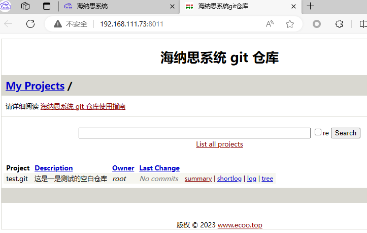

# 自建git仓库

Git 是一个开源的分布式版本控制系统，本节将为大家介绍如何在海纳思系统里创建一个 Git 仓库。  

## 安装和卸载

### 安装

海纳思系统为大家制作了完整的一个搭建 Git 仓库安装包```gieweb-histb.deb```  

在终端中输入如下命令即可安装完成：  
```bash
sudo apt-get update
sudo apt-get install gitweb-histb -y
```

安装完成后，首页的内网选项页就会增加一个图标，点击进去即可  
  
    


### 卸载

在终端中输入如下命令即可卸载：  
```bash
sudo apt-get purge gitweb-histb -y
sudo apt-get autoremove -y
```

## 使用

### 1.配置文件和位置

- nginx的配置文件在 `/etc/nginx/sites-available/nginx_gitweb`   
- git仓库根目录在  `/var/lib/git`   

### 2.


## 注意事项