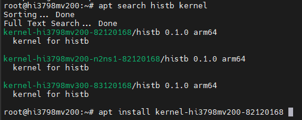

# 海思内核升级教程

作者根据定期用户反馈和功能需求，不定期更新内核，本章节的内核升级办法务必掌握。  


## 获取新内核

:::caution
注意：本章节仅仅适合海思芯片CPU的机顶盒设备。  
如果你不清楚，请勿试用！直到你完全理解什么叫做芯片为止！  
:::

### 方法一：使用 APT 直接获取新内核（推荐自动）

在终端中输入如下命令即可更新：  

```bash
sudo apt update
sudo apt search histb kernel
```

你会得到一个类似下图的匹配你的机顶盒的海思新内核。

  

接着执行你机顶盒对应的机型安装新内核，最后重启系统即可。  
```
sudo apt install kernel-hi3798mv200-82082668
或者例如：
sudo apt install kernel-hi3798mv100-81082668
```


### 方法二：新内核包含在最新的刷机包里 （手动）

社区发行版的刷机包里，一般都是最新的内核，  
如果你不想升级系统，只想更新内核，  
可以在刷机包里解压后得到 ```hi_kernel-xxx.bin```   
也可以在下表任选一个地址下载对应的内核。  

| 芯片分类 | 平台 | 下载节点 | 内核(3个下载地址任选一) |
| ------- | ----- | ------- | ----- |
| hi3798mv100 | armv7 | 移动1 | [hi_kernel-hi3798mv100.bin](https://node.histb.com:9088/update/soft_init/kernels/armhf/hi_kernel-hi3798mv100.bin) |
|  |  | 香港2 |[hi_kernel-hi3798mv100.bin](https://node2.histb.com/update/soft_init/kernels/armhf/hi_kernel-hi3798mv100.bin)  |
|  |  | 电信3 |[hi_kernel-hi3798mv100.bin](https://node3.histb.com:9088/update/soft_init/kernels/armhf/hi_kernel-hi3798mv100.bin)  |
| hi3798mv200 | arm64 | 移动1 | [hi_kernel-hi3798mv200.bin](https://node.histb.com:9088/update/soft_init/kernels/arm64/hi_kernel-hi3798mv200.bin) |
|  |  | 香港2 |[hi_kernel-hi3798mv200.bin](https://node2.histb.com/update/soft_init/kernels/arm64/hi_kernel-hi3798mv200.bin)  |
|  |  | 电信3 |[hi_kernel-hi3798mv200.bin](https://node3.histb.com:9088/update/soft_init/kernels/arm64/hi_kernel-hi3798mv200.bin)  |
| hi3798mv300 | arm64 | 移动1 | [hi_kernel-hi3798mv300.bin](https://node.histb.com:9088/update/soft_init/kernels/arm64/hi_kernel-hi3798mv300.bin) |
|  |  | 香港2 |[hi_kernel-hi3798mv300.bin](https://node2.histb.com/update/soft_init/kernels/arm64/hi_kernel-hi3798mv300.bin)  |
|  |  | 电信3 |[hi_kernel-hi3798mv300.bin](https://node3.histb.com:9088/update/soft_init/kernels/arm64/hi_kernel-hi3798mv300.bin)  |
| mv200恩兔特别版 | arm64 | 移动1 | [hi_kernel-hi3798mv200-n2ns1.bin](https://node.histb.com:9088/update/soft_init/kernels/arm64/hi_kernel-hi3798mv200-n2ns1.bin) |
|  |  | 香港2 |[hi_kernel-hi3798mv200-n2ns1.bin](https://node2.histb.com/update/soft_init/kernels/arm64/hi_kernel-hi3798mv200-n2ns1.bin)  |
|  |  | 电信3 |[hi_kernel-hi3798mv200-n2ns1.bin](https://node3.histb.com:9088/update/soft_init/kernels/arm64/hi_kernel-hi3798mv200-n2ns1.bin)  |


## 手动更新内核

- 内核在 emmc 的第 6 分区；  
- 第 6 分区的设备号是 `/dev/mmcblk0p6`； 
- 32位的内核占 20M 空间，就是20480x1024字节；  
- 64位的内核占 40M 空间，就是40960x1024字节；   
- 采用 Linux 的 dd 命令进行烧写即可。  

### hi3798mv100机型

hi3798mv100机型是 armv7 ; 也就是我们理解的 32 位；  
将内核上传进去系统里，或者在当前位置执行如下命令：  
```bash
wget https://node.histb.com:9088/update/soft_init/kernels/armhf/hi_kernel-hi3798mv100.bin -O hi_kernel-hi3798mv100.bin
dd if=hi_kernel-hi3798mv100.bin of=/dev/mmcblk0p6 bs=1024 count=20480
```

### hi3798mv200/300机型

将内核上传进去系统里，或者在当前位置执行如下命令：  
```bash
wget https://node.histb.com:9088/update/soft_init/kernels/arm64/hi_kernel-hi3798mv200.bin -O hi_kernel-hi3798mv200.bin
dd if=hi_kernel-hi3798mv200.bin of=/dev/mmcblk0p6 bs=1024 count=40960
```

```bash
wget https://node.histb.com:9088/update/soft_init/kernels/arm64/hi_kernel-hi3798mv300.bin -O hi_kernel-hi3798mv300.bin
dd if=hi_kernel-hi3798mv300.bin of=/dev/mmcblk0p6 bs=1024 count=40960
```

### hi3798mv200恩兔特别版机型

将内核上传进去系统里，或者在当前位置执行如下命令：  
```bash
wget https://node.histb.com:9088/update/soft_init/kernels/arm64/hi_kernel-hi3798mv200-n2ns1.bin -O hi_kernel-hi3798mv200-n2ns1.bin
dd if=hi_kernel-hi3798mv200-n2ns1.bin of=/dev/mmcblk0p6 bs=1024 count=40960
```


执行完后，重启系统即可。

## 注意事项

如何了解你的内核版本号：  
社区版内核编号规则如下：  

```
系统版本 : Ubuntu 20.04.6 LTS | V20251001-4.4.35_ecoo_82082668-64
```

其中：```82082668``` 第二个数字 2 代表mv200系列， 0826 代表 2025版本的08月26日

其它自行推算。

内核升级了什么，一般在群里公布，系统版本升级后也会出现在《系统使用说明》里。


