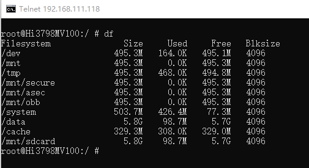

# ADB 刷机(海思)

机智的利用前面两种方法的原理，免拆盖子，免短接，免TTL线，  
利用安卓系统的后台linux终端的命令，将制作的烧片器文件dd克隆进去覆盖整片emmc。  
前提：
你必须破解这个盒子原来的安卓系统，或者按照网上的教程，刷入一个破解的安卓系统，  
使用adb shell或者telnet能够登录安卓后台终端。  
这些安卓的破解教程或者adb工具网上有很多，应该还是大部分能找到的。  
就是稍微有点折腾，没有前面两种方法来的干脆。  
如果前面两种办法尝试无果的话，这个办法也很香。  


## 准备工作

:::caution

- NAND闪存和高安板无法刷目前的固件
- 高安板常见于四川地区、河北地区、上海地区的hi3798mv100电信的盒子
- 对 adb 了解不足的小白谨慎使用此方式。是的，别瞎凑热闹！
:::

- 格式化为 fat32 文件系统的 U 盘，用于存放自制的【烧片器】；
- adb 程序，用于登录安卓后台；
- Hitool工具，用于自制【烧片器】；

## 进入安卓后台获取regname设备信息

  
在安卓后台终端输入以下命令，读取盒子的 reg name 管脚对应名称;
```bash
cat /dev/block/mmcblk0p1 | grep -a hi3798m
```

得到下图的数值： ```hi3798mdmo1g```  

  

注意，当你输入cat /dev/block/mmcblk0p1返回信息是没有这个文件或者文件夹时，  
继续检查 ls -al /dev/block/ ，假如看到有mtdblk字样，代表你这个盒子闪存是NAND，请放弃。  


