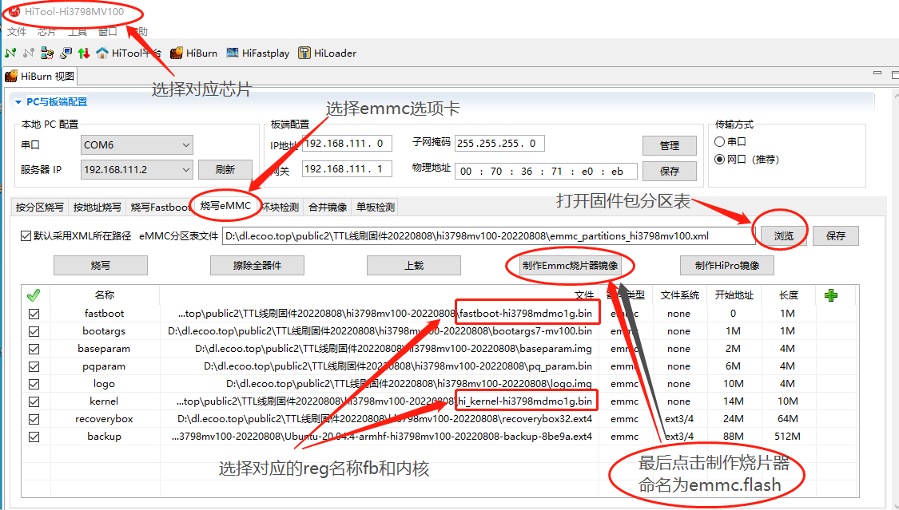
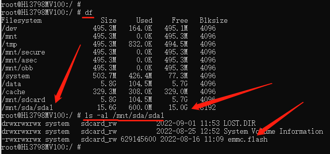
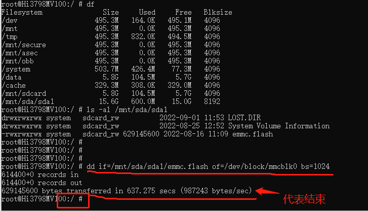

# ADB 刷机(海思)

机智的利用前面两种方法的原理，免拆盖子，免短接，免TTL线，  
利用安卓系统的后台linux终端的命令，将制作的烧片器文件dd克隆进去覆盖整片emmc。  
前提：
你必须破解这个盒子原来的安卓系统，或者按照网上的教程，刷入一个破解的安卓系统，  
使用adb shell或者telnet能够登录安卓后台终端。  
这些安卓的破解教程或者adb工具网上有很多，应该还是大部分能找到的。  
就是稍微有点折腾，没有前面两种方法来的干脆。  
如果前面两种办法尝试无果的话，这个办法也很香。  


## 准备工作

:::caution

- NAND闪存和高安板无法刷目前的固件
- 高安板常见于四川地区、河北地区、上海地区的hi3798mv100电信的盒子
- 对 adb 了解不足的小白谨慎使用此方式。是的，别瞎凑热闹！
:::

- 格式化为 fat32 文件系统的 U 盘，用于存放自制的【烧片器】；
- adb 程序，用于登录安卓后台；
- Hitool工具，用于自制【烧片器】；

## 进入安卓后台获取regname设备信息

  
在安卓后台终端输入以下命令，读取盒子的 reg name 管脚对应名称;
```bash
cat /dev/block/mmcblk0p1 | grep -a hi3798m
```

得到下图的数值： ```hi3798mv100  mdmo1g```  

  

注意，当你输入```cat /dev/block/mmcblk0p1```返回信息是没有这个文件或者文件夹时，  
继续检查 ```ls -al /dev/block/``` ，假如看到有```mtdblk```字样，代表你这个盒子闪存是 NAND，请放弃。  

## 根据盒子型号自制烧片器

1.下载你对应的 reg 名称的 TTL 线刷固件包，解压；  
2.打开海兔工具，选择芯片，选择烧写 emmc 选项卡，浏览打开解压包里的 XML 分区表文件；  
3.按照下图例子，制作烧片器：  
  

:::tip
烧片器长度计算：最后一个分区的开始地址 + 最后一个分区的 img 文件的大小  
比如：610M + 616M = 1226M，你就输入 ```1226M``` 字样即可。  
:::

## 自制烧片器放到准备好的U盘

保存上面制作的emmc.flash文件，并复制到前面fat32格式化后的U盘根目录

## 插到盒子上进去adb后台烧写

将带有 emmc.flash 的 U 盘插入盒子的 usb 口上；  
在 adb shell 或者 telnet 登录安卓后台的窗口输入 df -h 查看u盘是否自动挂载好；  
如果发现有 sda1 存在，继续输入 ls -al /mnt/sda/sda1 查看是否存在 emmc.flash 文件；  

  

检查上面步骤都正确以后，输入以下命令进行烧写。  
```bash
dd if=/mnt/sda/sda1/emmc.flash of=/dev/block/mmcblk0 bs=1024
```

  

## 注意事项

:::caution
注意: 整个烧写过程大概历时 5-8 分钟，全程不可关闭终端窗口，不可碰盒子和 u 盘。  
注意：烧写完成后，直接手动断电重新上电启动，继续等待 3 分钟初始化。  
注意：初始化完成后，到路由器查看重新分配的 IP 地址，mac 是 00:11:22:33:44:55  
注意：这是一次性的刷机，一旦 dd 命令执行，就再也回不去了。如果刷入不正确的包，只能TTL救砖！
:::
