# 比特米盒（晶晨S905x)刷机

轻 nas 盒子，名称很多，私家云二代、比特米盒、cumebox2、cm2-b  
这盒子扩展接口非常丰富，有两个 usb2.0，一个 typec，一个 sd 卡槽，  
一个 hdmi ，一个百兆网口，然后盒子里面还有两个2.5寸 sata 硬盘仓。  
作者已编译适配刷入海纳思系统固件。  
已修复led屏显，wifi，自动风扇等。  

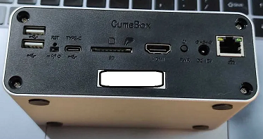   
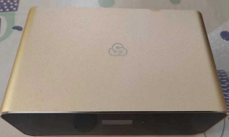  

## 一、准备工作  

### 1.准备一个 USB-TypeC 数据连接线 

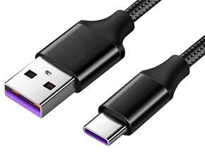  

### 2.下载以下全部软件

a.晶晨烧录工具: USB_Burning_Tool.exe  
b.安卓 6 代固件： atv6.img  
c.安卓切换卡载系统应用包：切换卡载系统V1.0.apk  
d. U 盘启动的固件包：Hinas_cumebox_USB.img  
e. 刷入 emmc 的海纳思固件包：Hinas_cumebox_EMMC.img  

[下载地址：https://alist.ecoo.top/amlogic/s9xxx/cumebox](https://alist.ecoo.top/amlogic/s9xxx/cumebox)  

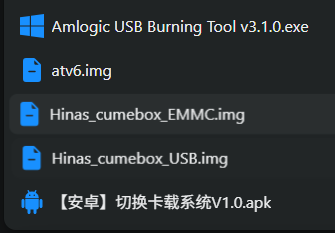  
  
### 3.拆开盒子，取出主板  

-撬开4个垫胶片，拧开4枚螺丝  

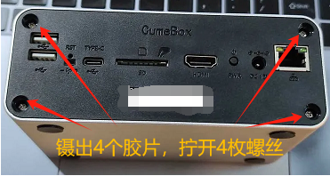  

-再拧开里面1枚螺丝  
-拇指往下按，外壳往上抽，即可取出主板  


### 4. 准备晶晨烧录软件

下载和安装好:  
  
晶晨烧录工具: [USB_Burning_Tool.exe](https://www.ecoo.top/update/soft_init/amlproject/USB_Burning_Tool_v2.1.3.exe)


## 二、烧写刷入安卓 6.0 系统  

:::tip
这是一次性的刷安卓系统，可以看电视，安装安卓应用软件等功能，  
如果已经刷过安卓系统，可以忽略跳过此步骤。
:::


### 1. 找到主板短接点：
下面提供作者收集到的图例：  

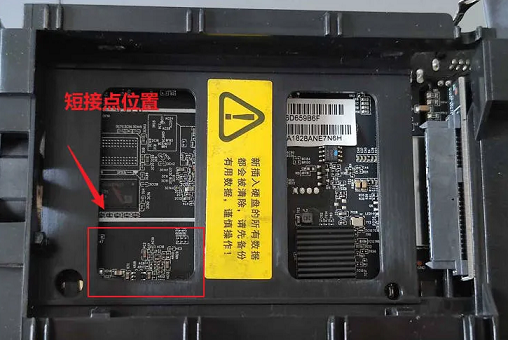  
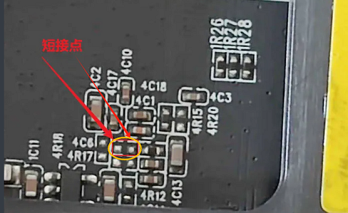  

### 2. 晶晨烧写工具导入安卓包

打开 USB_Burning_Tool 软件工具，导入刚才下载的 atv6.img 固件   

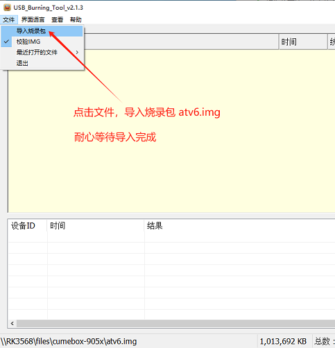  


### 3. 烧写安卓系统

数据线一端插入电脑的 USB 口，

短接住两个短接点-->TypeC 口插入盒子-->显示已连接-->放开短接-->点击 “开始” 按钮  

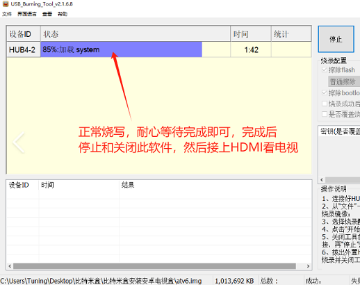  

正常情况下，你短接到位，就一定会显示```已连接``` ;  
如果烧写失败，一般都是数据线接触不良，请检查每个步骤，重新操作即可。  

:::tip
遇到问题时，可尝试以下可能的办法：  
1.先点击开始，等短接后设备识别到，直接进入刷机；  
2.更换数据线或 USB 口试试；  
3.如遇到识别为 MTP 设备，按住reset键，上电5秒后松放，再重新线刷。
:::


### 5. 拔掉数据线、关闭软件。  

最后，拔掉连接线，关闭软件。至此，安卓系统烧写刷入完成。  
接上 HDMI 屏幕，接上 usb 鼠标，即可操作此安卓系统。  

### 6. 安装切换卡载系统V1.0.apk

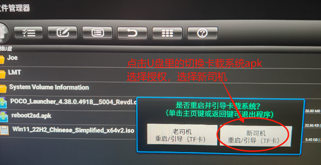  

- 将“切换卡载系统V1.0.apk”保存到 U盘  
- 插入盒子，文件管理器找到 U 盘，点击安装  
- 选择授权，选择“新司机”，安装成功后，拔掉 U 盘，重启即可
- 此时，盒子将会优先读取 U 盘的可引导系统启动  
- 如果你只想使用安卓看电视，到此处即可完成收工。

## 三、制作可引导启动的 U 盘海纳思系统

### 1.下载 USB 镜像烧写工具 balenaEtcher.exe

[balenaEtcher.exe](https://alist.ecoo.top/d/amlogic/S805%E7%8E%A9%E5%AE%A2%E4%BA%91/balenaEtcher-Portable-1.18.4.exe?sign=MHDPudLBAXTQfQArZnZIid6qcLLudZ4U0dhjWY_SHZU=:0)  


### 2.制作 U 盘海纳思系统

右键管理员身份（必须！）打开 balenaEtcher 工具，插入一个准备好的 U 盘到电脑

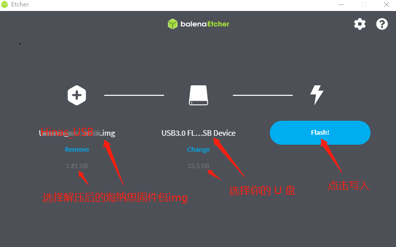  

注意：软件显示 U 盘成功写完镜像后，务必等待10秒再拔出 U 盘。（知道啥叫作缓存吧）

### 3.启动 U 盘的系统
将制作好的U盘插入盒子usb口，  
接好HDMI，接好网线到路由器，  
重新上电启动即可。 

通过HDMI屏幕查看启动情况，启动完毕后，去路由器查找IP，
使用ssh终端，进入后台，可参照本站的教程：

[https://www.ecoo.top/docs/tutorial-extras/start](https://www.ecoo.top/docs/tutorial-extras/start)

:::tip
此时，你已经完成了双系统的操作，  
如果你期望双系统运行，插上此U盘，即可使用NAS，  
拔掉U盘重新启动，即可使用安卓系统看电视，  
到此处即可完成收工。
:::


## 四、将海纳思系统刷入内置存储 EMMC

 
## 五、启动海纳思 NAS 系统

### 1. 重新上电，等待 2-3 分钟，首次初始化启动完毕

 等待 2-3 分钟，首次启动完毕，即可到路由器查找自动分配的 IP；  
 这个 IP 在你的路由器客户端列表中，显示的 mac 地址是 `00:11:22:33:44:66`  

### 2. 浏览器打开该 IP 地址，进入 web 管理页面  

详细阅读[《开始使用》](/docs/tutorial-extras/start) 教程！  


## 六、恭喜你拥有这台低功耗的家用 NAS 系统


我是小盒子，也是大世界！  
海纳思系统，绝对值得拥有！   


## 六、常见问题解答


