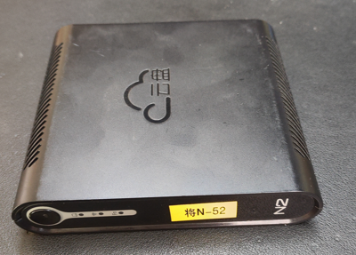
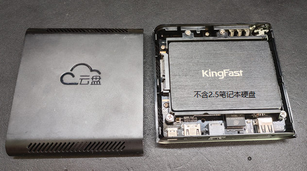
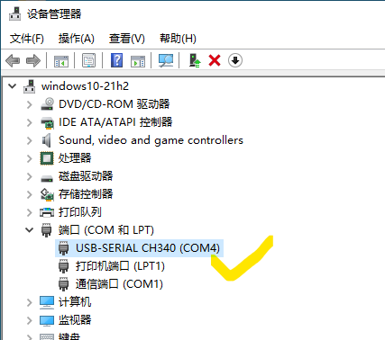
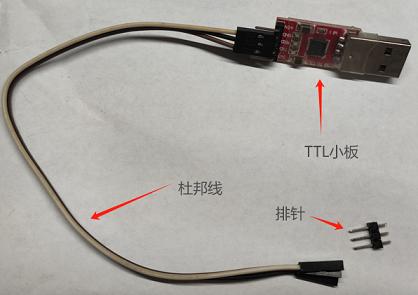
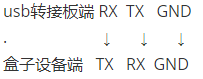
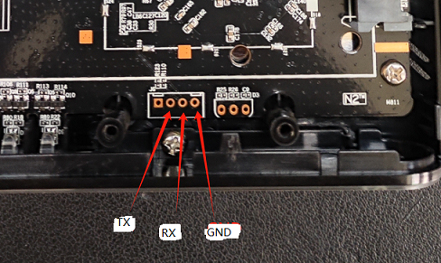
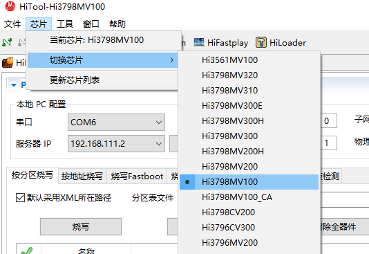
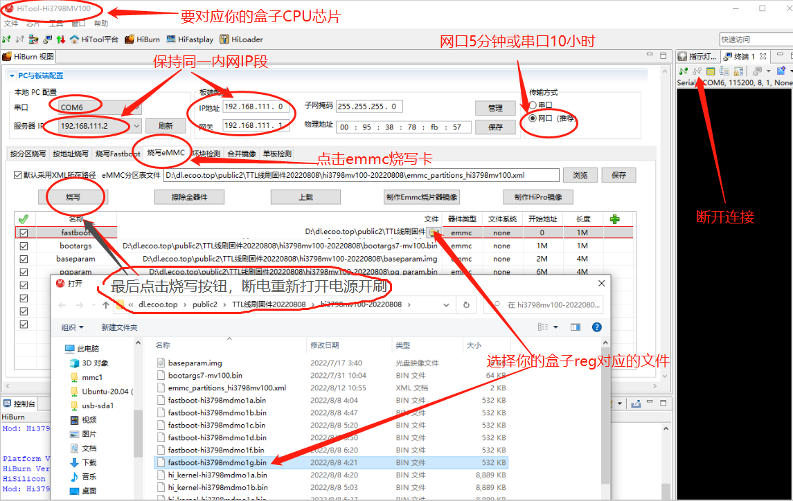
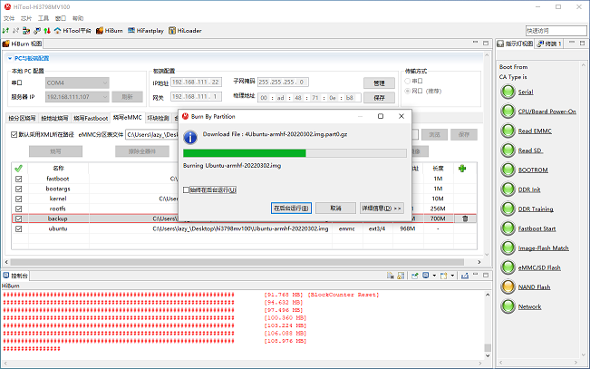
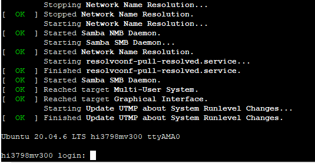

# 恩兔 TTL 刷机(海思芯片)

需要用到USB转TTL串口刷机小板，这种刷机方法通过TTL串口刷机线连接盒子与电脑。通过电脑软件与盒子串口进行命令行交互，实时显示盒子后台，类似电脑命令行。

## 准备工作

- 一套USB转TTL设备小板（推荐CH340G），杜邦线，排针，或需要电络铁；
- 下载好Hitool工具（华为海思官方刷机工具，简称海兔工具）；
- 一根网线连接机顶盒到路由器的LAN口；
- windows7含以上的操作系统；
- 一个华为海思芯片的机顶盒；

| 使用平台            | 国内高速下载地址        | 备用海外下载地址 | 
| ------------------ | --------------------- | ----------------- | 
| Windows    | [海兔工具Windows版](https://node4.histb.com:9088/update/soft_init/hitool/HiTool-windows.7z)	 |	[海兔工具Windows版](https://node2.histb.com/update/soft_init/hitool/HiTool-windows.7z)   | 
| Linux      | [海兔工具Linux版](https://node4.histb.com:9088/update/soft_init/hitool/hitool_linux.tar.gz)| [海兔工具Linux版](https://node2.histb.com/update/soft_init/hitool/hitool_linux.tar.gz)| 

   

恩兔 N2 盒子：  
  
  


## 下载海纳思系统的固件

- 恩兔的海思芯片机型 reg 名称是 hi3798mv2dmc 。 
- [作者发布的官方网站下载地址](/download)  

| 芯片机型| 刷机类型| 下载地址 | 系统平台 | 备注 |
| --------- | ------- | ---- | ------- | ------- |
|hi3798mv200恩兔| TTL串口刷机包 | [TTL-hi3798mv200-n2ns1-64bit.zip](https://node4.histb.com:9088/update/system/TTL-hi3798mv200-n2ns1-64bit.zip)   | arm64|N2特别版|  


## 刷机技术要领

### 准备工作的几个知识点
- windows版“海兔”软件无需安装，解压后打开hitool.exe即可使用。  
如遇到设置错误，删除整个文件夹，重新解压即可。  
“海兔”软件所在磁盘位置必须至少有3GB的剩余空间（刷机过程有解压缩动作）。
- 请首先关闭电脑防火墙，杀软等阻拦69端口通讯的设置。
- USB-TTL转接板最好用免驱的CH340，淘宝价大约8元左右包邮，含杜邦线和排针。
- 只接上GND，TX，RX三个点即可，瞎接VCC可能会导致烧坏板子。  
接线顺序：TTL转接板的GND接盒子主板的GND，TX接RX，RT接TX；  
如果接线顺序错误，跑码时就会出现乱码；  
- 小板的跳线端子请插到3.3V。
- 盒子的TTL串口波特率为115200

### 第一步：接好TTL线

- 将usb转ttl模块（CH340模块为例）的usb口插到电脑，检查是否免驱或者需要安装对应驱动。  
记住这个COM口的数字，比如这里的COM4.CH340转接模块多数是免驱的，CP2102,3202等，多数是需要安装驱动的。
  
参照下图接好杜邦线：  
  
  

- 如果你没有小锡焊机，那么就用些技巧，将排针稳稳的靠在盒子主板的GND，TX，RX的小孔上。  
小孔周边的小铜圈必须要接触到，才算导通哦。作者有时候会用夹子或者镊子；  



### 第二步：打开hitool软件工具跑码（检查盒子芯片型号参数）
- 请按照下图的示范，进行跑码操作：  
  

- 如果遇到跑码是乱码，请检查TTL杜邦线是否接牢，是否有交叉对调TXRX；
- 无论如何，只有完全这正确的保证3根串口线正常通讯，才能进行刷机操作；
- 先点击终端的连接，再打开电源，才会重新跑码；
- 跑码结果可以评估你的盒子硬件参数，如有看不懂的参数，可以在群里咨询；
- 跑码结束或者你已经获得所需要的信息后，务必点击"断开"终端的连接按钮，才进行下一步。

### 第三步：正式刷机

- 选择芯片，选择串口为你的转接器COM口，点击刷新COM口检查是否正确，  
如果不知道芯片型号，在上面的跑码信息里可以得到；  
  

- 选择EMMC刷机，选择网口刷机（网口刷5-8分钟，串口刷10小时）  
选择网口刷机，必须要从盒子的网口插上网线到路由器LAN口哦！

- 服务器IP是指你的电脑IP
- 板端IP是指你的盒子接到路由器获得的IP
- 网关是指你的路由器IP。这两个必须在同一网段，即前三位数字要相同。
- 点击“烧写emmc”的选项卡，选择固件的分区表文件xml，检查对应各分区的文件是否正确，  
  

- 点击“浏览”按钮选择你下载的固件包解压后的xml分区表文件；
- 鼠标放到第一分区的同一栏“文件”，浮出的文件夹图标，  
点击选择刷机包里你的盒子型号对应的fastboot-hi38798mvxxx.bin；
- 按照上图所示，全部准备好后，点击烧写，然后重新上电，就会开始正式烧写刷机。
- 如果遇到一些顽固的盒子内置系统，可以先“擦除全器件”按钮，先擦除emmc里的原系统。  
继续科普，擦除前要先选择刷机表，再操作擦除；  
擦除后，emmc为空（俗称砖），此时再跑码，显示从usb读取；  
相当于短接的效果；当CPU检测到emmc为空，或者短接操作，就会从usb读取刷机文件。  
- 烧写过程中遇到的问题：  
1.出现TTTTT，网线没接好，或者不通，防火墙阻止或电脑笔记本wifi断线或你接光猫？  
2.出现无法下载fastboot，明显是型号不匹配，请选择正确的对应型号fastboot；  
3.出现端口被占用，请关闭其它使用串口的连接；  
4.出现emmc bad writing之类的，大概率是emmc锁死了，放弃；  
5.看教程都需要一（亿）点点天赋的，不会刷，买一个作者刷好的盒子不香吗？  

### 第四步：等待系统开机初始化

- 烧写过程：  
  

- 烧写结束后，可以打开刚才跑码的终端，观察它启动系统时的跑码信息；
- 可以从启动信息观察到它初始化的时间大概要多久，正常1-2分钟；
- 直到出现如下图，出现登录的界面，代表刷机正式完成并且成功！
- 系统的运行跑码信息，可以让开发者或使用者随时掌握问题，了解原因。

   

- 你也可以在这个串口终端位置登录进去系统，快速得到IP信息。
- ttyAMA0的登录账密默认就是系统的后台默认初始账密 ```root``` ```ecoo1234```

### 最后

初始化结束后，请尝试到路由器客户端列表管理页面查看自动分配给机顶盒的IP，浏览器输入该IP地址进入盒子的NAS管理首页。
