# 瑞芯微(rk3399-sw799)刷机

瑞芯微(rk3399-sw799)sw799系列核心板，  
4G运存+8G闪存+nvme硬盘接口+双网口；   
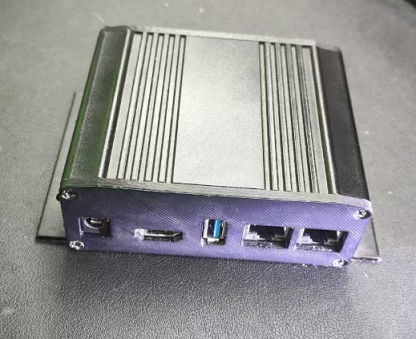  
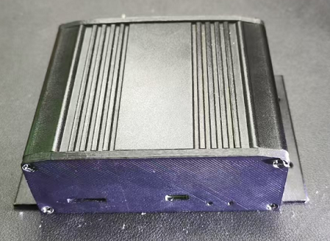  
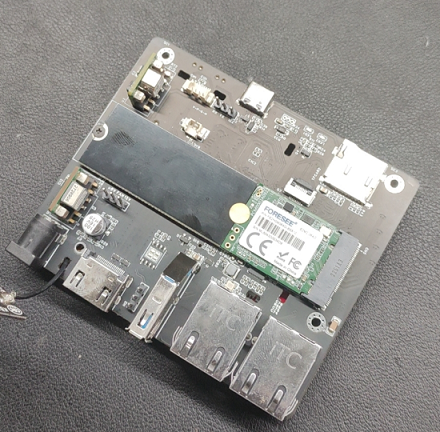  
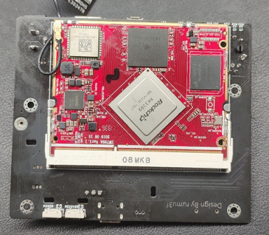  

直接使用定制工具刷入作者编译的海纳思系统固件。  

## 一、准备工作  

### 1.准备一个 USB + TypeC 数据连接线  

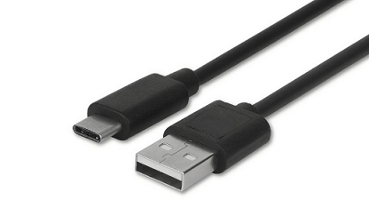  
  
### 2. 电脑安装瑞芯微设备驱动

一台 Windows7 以上电脑操作系统。

瑞芯微设备驱动下载地址:  

[DriverAssitant_v5.1.1.zip](https://www.ecoo.top/update/soft_init/rk3399sw799/DriverAssitant_v5.1.1.zip)  

下载后解压，安装。

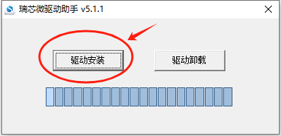  

### 3.下载作者定制的专用刷机工具

瑞芯微-海纳思专用刷机工具下载地址 (267M) :  

[RKDevTool_v3.15_for_hinas.zip](https://www.ecoo.top/update/soft_init/rk3399sw799/RKDevTool_v3.15_for_hinas.zip)  

下载后请解压。 

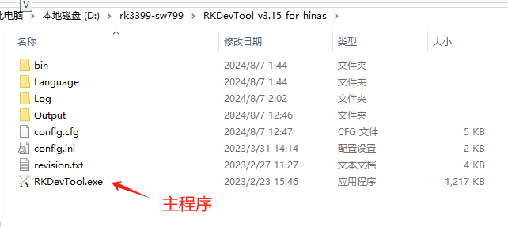  

## 二、线刷海纳思系统

### 1. 打开刷机工具主程序

### 2. TypeC口 接盒子， USB口 接电脑  

### 3. 网线接路由器 Lan 口，另一端接靠外的盒子网口

不要接靠里面的网口。

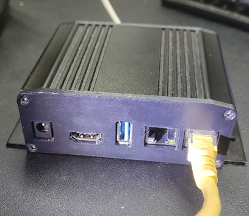  

### 4. 开始刷机  

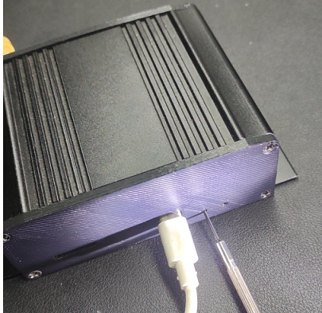  

如上图，用工具或者小针顶住 recovery 小孔，打开电源，  

顶住的时候有手感，顶住了，别松开，打开电源。  

此时主程序会出现如下图的状态，“发现一个LOADER设备”出现，即可放开。  

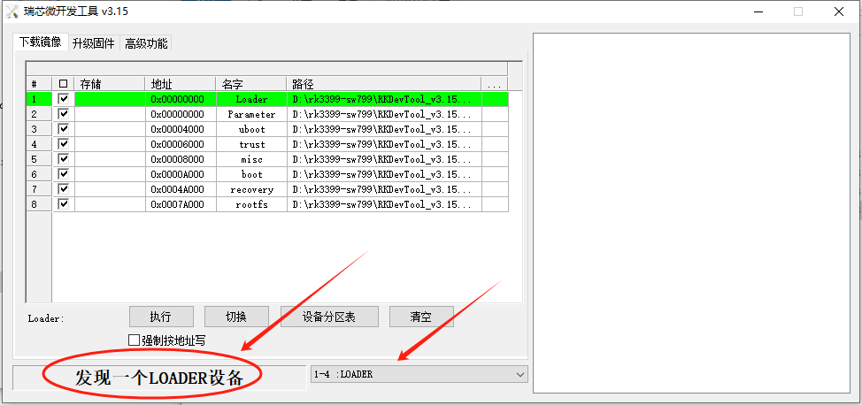  

然后，点击执行，

就会开始自动刷入系统，直到完成即可。

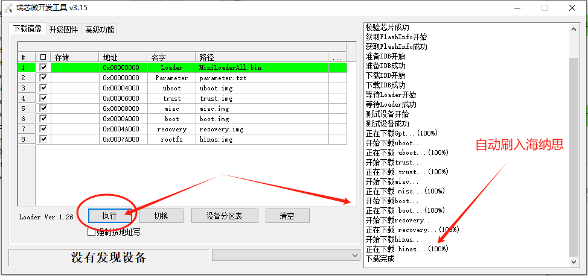  

接下来无须重启，稍后1-2分钟系统自动会重启并初始化，  
稍后去路由器查看设备的 IP 地址即可。

:::tip
如果提示文件不存在，则点击中间框右边的...栏，弹出文件选择框，找到对应的文件名称，选中，确定即可。

:::

## 三、启动海纳思系统

### 1. 等待 2-3 分钟，首次初始化启动完毕

 等待 2-3 分钟，首次启动完毕，即可到路由器查找自动分配的 IP；  
 这个 IP 在你的路由器客户端列表中，显示的例子如下图：  
 
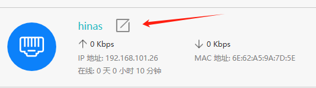  

### 2. 浏览器打开该 IP 地址，进入 web 管理页面  

详细阅读[《开始使用》](/docs/tutorial-extras/start) 教程！  

## 四、恭喜

最后，恭喜您拥有一台千兆的家用 linux 服务器系统 ！  
我是小盒子，也是大世界！  
海纳思系统，绝对值得拥有！   

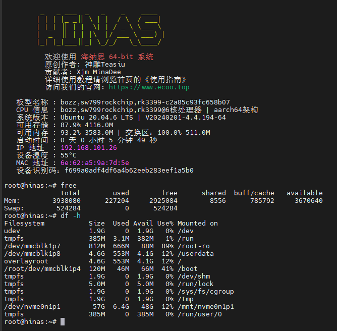  

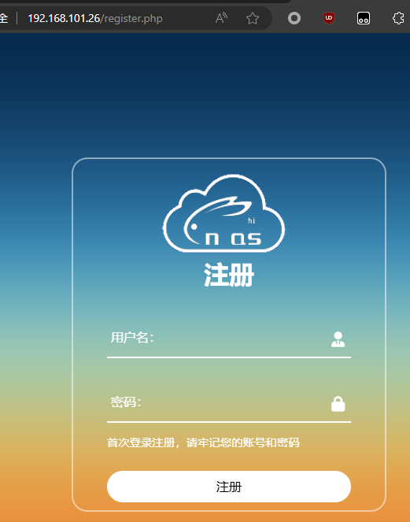  

## 五、常见问题解答

### 1.这个盒子可以刷其它系统

以下是搜集到的可以刷机的固件：
- 海纳思系统
- openwrt系统
- armbian系统
- 萤火ubuntu系统

https://files.kos.org.cn/rockchip/fine3399/  

https://github.com/QXY716/Fine3399-rk3399-armbian/releases

### 2.刷海纳思系统的注意事项

