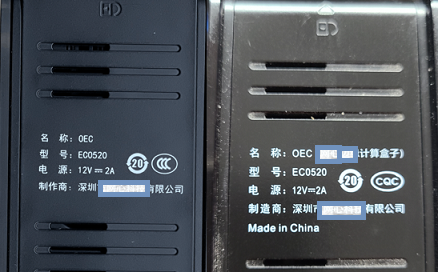
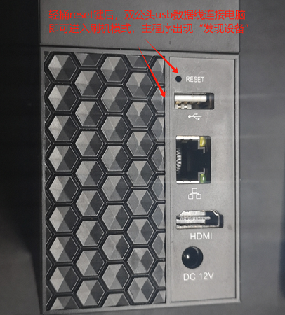

# 瑞芯微(rk3566-OEC/-T)刷机

OEC/OEC-Turbo盒子，网心云型号ec0520，采用的rk3566芯片，  
CPU Rockchip RK3566 
内存 4G   
闪存 8G  
千兆网口  

这个盒子 12V2A 电源适配器，支持自插内置 2.5 寸笔记本硬盘，  
搭配刷入海纳思系统，简直就是家用存储的利器！  

作者已编译适配刷入海纳思系统固件。  

  
  

## 一、准备工作  

### 1.准备一个 USB-TypeC 数据连接线  

  
  
### 2. 电脑安装瑞芯微设备驱动

一台 Windows7 以上电脑操作系统。

瑞芯微设备驱动下载地址:  

[DriverAssitant_v5.1.1.zip](https://www.ecoo.top/update/soft_init/rk3399sw799/DriverAssitant_v5.1.1.zip)  

下载后解压，安装。

  

### 3.下载作者定制的专用刷机固件

瑞芯微-海纳思专用刷机固件下载地址  :  

地址1[Rockchip_3566_oect_for_hinas.zip](https://alist.ecoo.top/d/rockchip/Rockchip_3566_oect_for_hinas.zip?sign=NyuYGBTE5N6XnLOp4eWUk-8S5uc1SteBbM9rzy7HkLs=:0)  

地址2[Rockchip_3566_oect_for_hinas.zip](https://www.ecoo.top/update/soft_init/rk3566/Rockchip_3566_oect_for_hinas.zip)  

下载后请解压。 

  

## 二、线刷海纳思系统

### 1. 打开刷机工具主程序

### 2. 双公头 USB 一端接电脑，按住 reset 键后，另一端插入盒子  

### 3. 开始刷机  

  

如上图，用工具或者小针顶住 reset 小孔后，插入连接电脑的双公头 USB ，  

顶住的时候有手感，顶住了，别松开，插入插入连接电脑的双公头 USB。  

此时无须插电源（双公头usb会供电，你会看到指示led排灯亮起） 

此时主程序会出现如下图的状态，“发现一个maskrom设备”出现，即可放开。  

  

（如果出现的是loader设备，请点击高级功能选项卡，点击重启进入maskrom）  

勾选“按地址强制写”，点击执行，开始刷入固件。

开始自动刷入系统，直到完成即可。

  

完成后，拔掉usb，插入网线到路由器，插入电源，稍后3-5分钟系统自动会重启并初始化，  

稍后去路由器查看设备的 IP 地址即可。

:::tip
如果提示文件不存在，则点击中间框右边的...栏，弹出文件选择框，找到对应的文件名称，选中，确定即可。

:::

## 三、启动海纳思系统

### 1. 等待 3-5 分钟，首次初始化启动完毕

 等待 3-5 分钟，首次启动完毕，即可到路由器查找自动分配的 IP；  
 这个 IP 在你的路由器客户端列表中，显示的例子如下图：  
 
  

### 2. 浏览器打开该 IP 地址，进入 web 管理页面  

详细阅读[《开始使用》](/docs/tutorial-extras/start) 教程！  

## 四、恭喜

最后，恭喜您拥有一台海纳思家用 linux 服务器系统 ！  
我是小盒子，也是大世界！  
海纳思系统，绝对值得拥有！   

  

## 五、常见问题解答

### 1.拆机提示

   

### 2.reset无效的话，短接图

   

短接住，再插入usb，电脑刷机主程序就会出现“发现一个maskrom设备”

