# 玩客云(晶晨S805)刷机

晶晨系列 S805 CPU 机型，又称玩客云，赚3，ws1608, onecloud；  
直接使用晶晨烧录工具刷入作者编译的固件。  

## 一、准备工作  

### 1.准备一个双公头 USB 连接线  

  
  
### 2.拆开盒子，取出主板  

拆解外壳技巧：  
先热用吹风机把背后的pvc贴片吹软，然后用刀具小心撬开。   

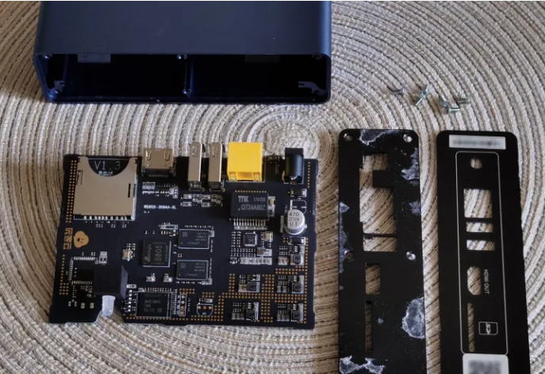  
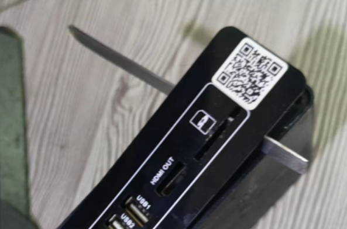  

### 3. 准备晶晨烧录软件

下载和安装好:  
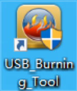  
晶晨烧录工具: [USB_Burning_Tool.exe](https://www.ecoo.top/update/soft_init/amlproject/USB_Burning_Tool_v2.1.3.exe)

### 4. 下载好作者最新开发的线刷包

下载后请解压。  

| 系统            | 下载地址        | 下载地址 | 备注 |
| ------------------ | -------------- | ------------ | ---------| 
| 海纳思社区版 | 地址1 | [hinas_s805_eMMC.burn.img.zip](https://node4.histb.com:9088/update/system/s805/hinas_s805_eMMC.burn.img.zip)|  |  
|  | 地址2 | [hinas_s805_eMMC.burn.img.zip](https://node2.histb.com/update/system/s805/hinas_s805_eMMC.burn.img.zip)|  |  
|  | 地址3 | [hinas_s805_eMMC.burn.img.zip](https://node3.histb.com:9088/update/system/s805/hinas_s805_eMMC.burn.img.zip)|  |  
| 宝塔版7.7 | 地址1 | [hinas_s805_baota_eMMC.burn.img.zip](https://node4.histb.com:9088/update/system/s805/hinas_s805_baota_eMMC.burn.img.zip)|  |  
|  | 地址2 | [hinas_s805_baota_eMMC.burn.img.zip](https://node2.histb.com/update/system/s805/hinas_s805_baota_eMMC.burn.img.zip)|  |  
|  | 地址3 | [hinas_s805_baota_eMMC.burn.img.zip](https://node3.histb.com:9088/update/system/s805/hinas_s805_baota_eMMC.burn.img.zip)|  |  

## 二、采用线刷烧写刷入海纳思系统

### 1. 找到主板短接点：
不同板子请自行百度短接位置，下面提供作者收集到的图例：  

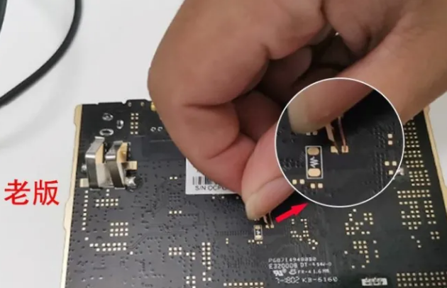   
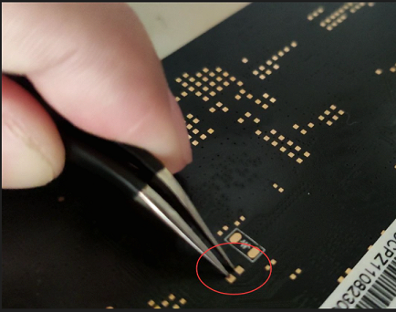   
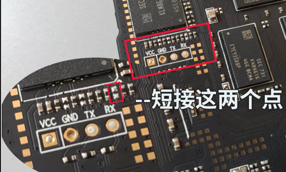   
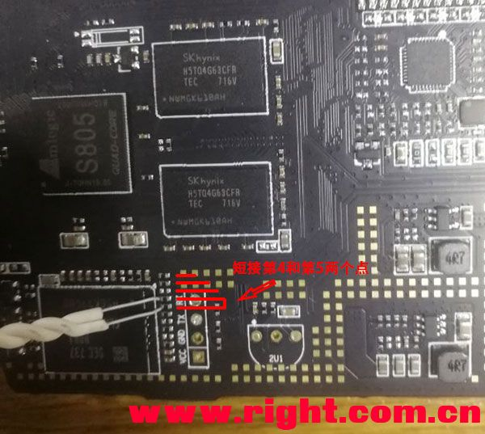   

### 2. 双公头 usb 连接：  

双公头 usb 连接线一头接电脑，一头接板子2号口（靠近 HDMI 的一边）  
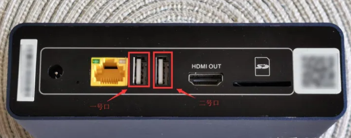  
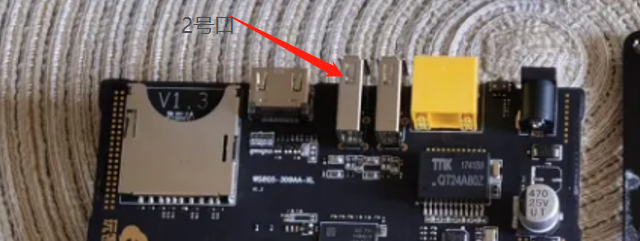  
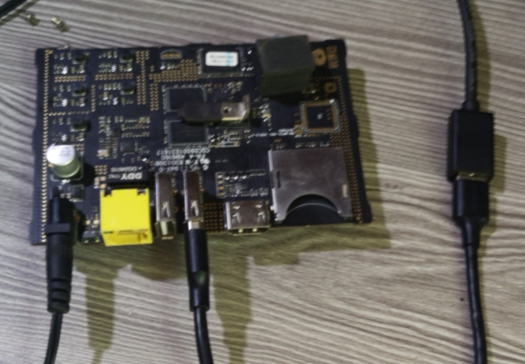  

### 3. 导入海纳思系统专用线刷包

打开 USB_Burning_Tool 软件工具，导入刚才解压后的 hinas_s805_eMMC.burn.img 固件包

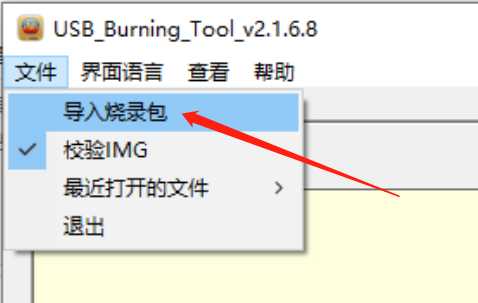  

### 4. 烧写海纳思系统专用线刷包

短接住-->打开盒子电源-->显示已连接-->放开短接-->点击 “开始” 按钮  

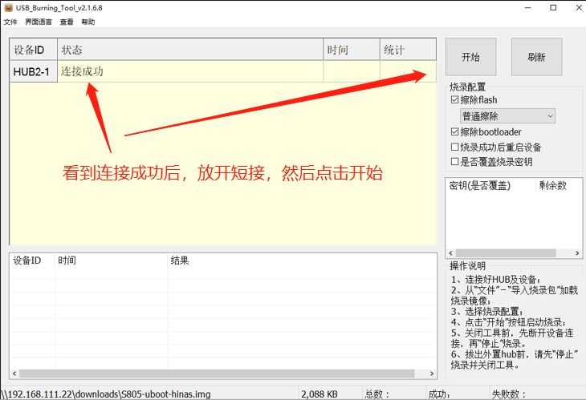  
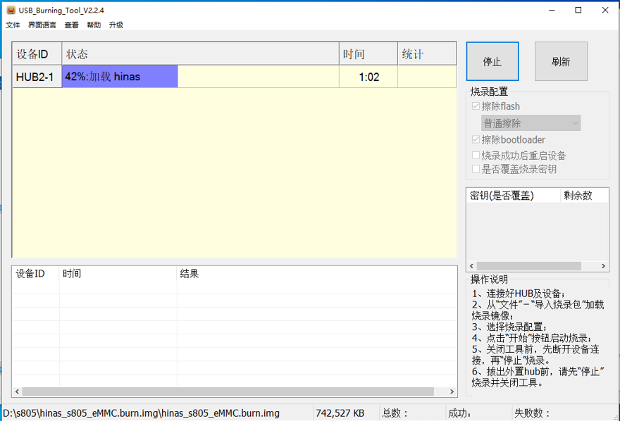  
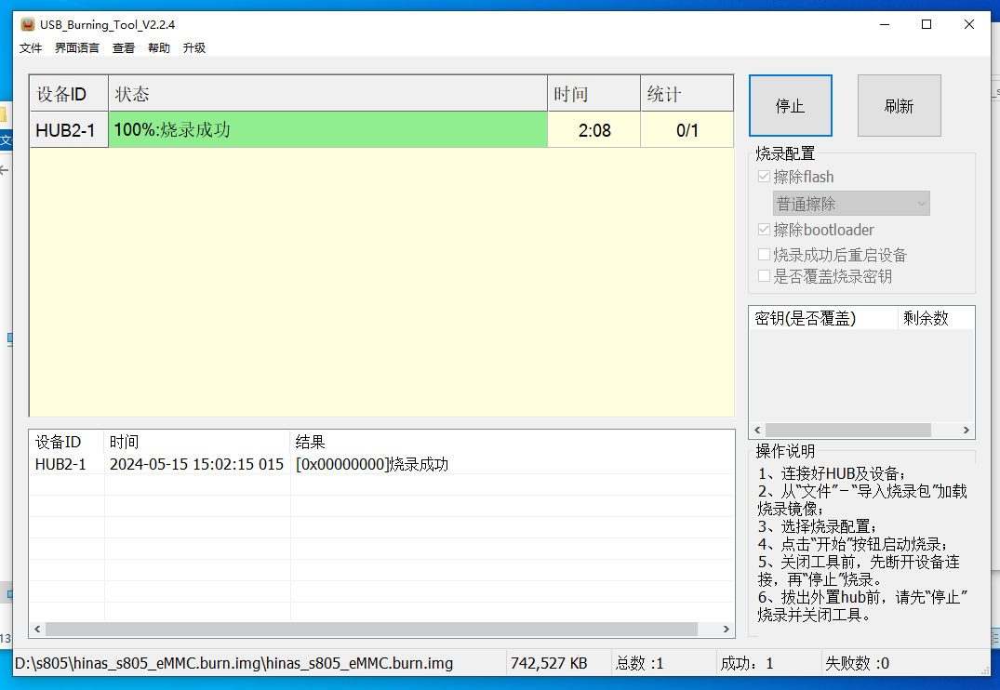  

正常情况下，你短接到位，就一定会显示```已连接``` ;  
如果烧写失败，请检查每个步骤；  
或选择全部擦除的选项试试。  

### 5. 拔掉双公头、关闭软件。  

最后，拔掉双公头连接线，关闭软件。至此，系统烧写刷入完成。  
:::tip
如果你需要重新刷机，就按照上面的流程操作一遍即可。
一般来说，下次刷机应该不需要短接，只要将双公头插入靠近HDMI的usb口，打开烧写软件，重新通电，就会显示已连接。  
:::

## 三、启动海纳思系统

### 1. 重新上电，等待 2-3 分钟，首次初始化启动完毕

 等待 2-3 分钟，首次启动完毕，即可到路由器查找自动分配的 IP；  
 这个 IP 在你的路由器客户端列表中，显示的 mac 地址是 `00:11:22:33:44:66`  

### 2. 浏览器打开该 IP 地址，进入 web 管理页面  

详细阅读[《开始使用》](/docs/tutorial-extras/start) 教程！  


如果你刷的是宝塔的系统，请详细阅读首页的《宝塔使用》链接！  


## 四、恭喜

最后，恭喜您拥有一台千兆的家用 linux 服务器系统 ！  
我是小盒子，也是大世界！  
海纳思系统，绝对值得拥有！   
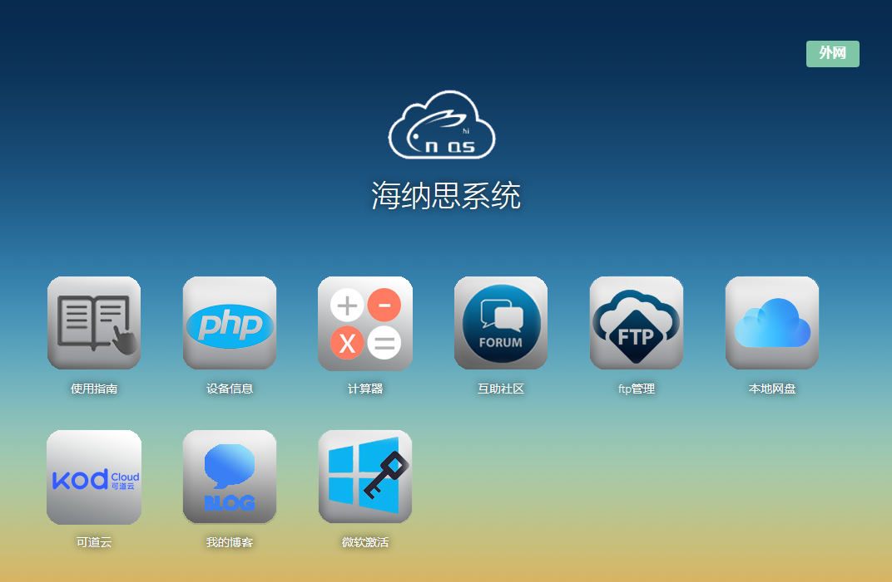   

## 五、常见问题解答

- 1. 同一局域网下多台同款盒子在运行，造成 MAC 地址冲突。


