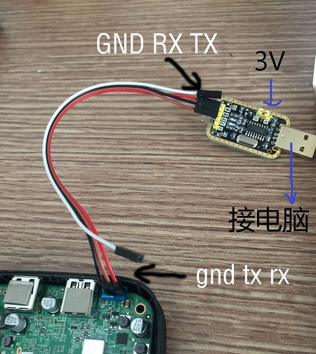
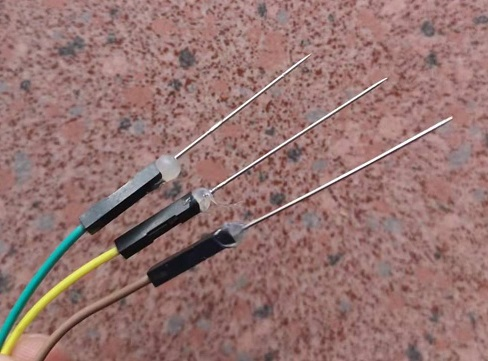

# TTL 刷机(海思)

需要用到USB转TTL串口刷机小板，这种刷机方法通过TTL串口刷机线连接盒子与电脑。通过电脑软件与盒子串口进行命令行交互，实时显示盒子后台，类似电脑命令行。

## 准备工作

- 一套USB转TTL设备小板（推荐CH340G），杜邦线，排针，或需要电络铁；
- 下载好Hitool工具（华为海思官方刷机工具）；
- 一根网线连接机顶盒到路由器的LAN口；
- windows7含以上的操作系统；
- 一个华为海思芯片的机顶盒；

| 使用平台            | 国内高速下载地址        | 备用海外下载地址 | 
| ------------------ | --------------------- | ----------------- | 
| Windows    | [海兔工具Windows版](https://node2.histb.com/update/soft_init/hitool/HiTool-windows.7z)	 |	[海兔工具Windows版](https://node2.histb.com/update/soft_init/hitool/HiTool-windows.7z)   | 
| Linux      | [海兔工具Linux版](https://node2.histb.com/update/soft_init/hitool/hitool_linux.tar.gz)| [海兔工具Linux版](https://node2.histb.com/update/soft_init/hitool/hitool_linux.tar.gz)| 

 

## 确认机顶盒reg名称

- [什么是机顶盒reg名称？如何知道我的机顶盒reg名称？](https://www.ecoo.top/getreg.html)
- [目前作者开发支持适配的机型列表](/devices)

## 下载匹配的固件

- 根据自己盒子的CPU型号和fastboot简称，下载匹配机型的固件包。
- [作者发布的官方网站下载地址](/download)

## 刷机技术要领

### 准备工作的几个知识点
- windows版“海兔”软件无需安装，解压后打开hitool.exe即可使用。  
如遇到设置错误，删除整个文件夹，重新解压即可。  
“海兔”软件所在磁盘位置必须至少有3GB的剩余空间（刷机过程有解压缩动作）。
- 请首先关闭电脑防火墙，杀软等阻拦69端口通讯的设置。
- USB-TTL转接板最好用免驱的CH340，淘宝价大约8元左右包邮，含杜邦线和排针。
- 只接上GND，TX，RX三个点即可，瞎接VCC可能会导致烧坏板子。  
接线顺序：TTL转接板的GND接盒子主板的GND，TX接RX，RT接TX  
接线顺序错误，跑码时将会出现乱码  
- 小板的跳线端子请插到3.3V。
- 盒子的TTL串口波特率为115200

### TTL刷机步骤
#### 第一步：接好TTL线
- 将usb转ttl模块（CH340模块为例）的usb口插到电脑，检查是否免驱或者需要安装对应驱动。  
记住这个COM口的数字，比如这里的COM4.CH340转接模块多数是免驱的，CP2102,3202等，多数是需要安装驱动的。
  
参照下图接好杜邦线：  
  
排针和杜邦线要保证不会断芯，如果某些板子的排针插口过小（ec6109-u），则可以考虑使用缝衣针点胶水固定到杜邦线口。  
  

在初始化完成前，请不要做任何操作。

部分mv200/mv300机型可能需要手动关闭电源，再打开电源，再等待初始化结束。

初始化结束后，请尝试到路由器客户端列表管理页面查看自动分配给机顶盒的IP，浏览器输入该IP地址进入盒子的NAS管理首页。
