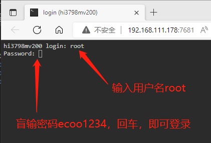

# 开始使用

刷机成功后，浏览器输入IP地址进入系统首页。接下来**首先要做的第一件事情**！

## 进入后台终端

:::caution
🉑️请首先要做第一件事就是修改密码。
:::

系统提供了两个账户，一个是具有全部权限的 root 用户，一个是普通权限的 ubuntu 用户，

默认账号 `root`，默认密码 `ecoo1234`

默认账号 `ubuntu`，默认密码 `ecoo1234`

- 建议使用 SSH 终端管理器登录后台

  Windows 操作系统可以使用 [putty](https://www.chiark.greenend.org.uk/~sgtatham/putty/latest.html) 工具或者 [MobaXterm](https://dl.histb.com/#/list/189cn/82531180155783956) 工具，

  Linux 操作系统直接 `ssh root@<IP>`

- 或者使用网页ttyd进入后台终端

  浏览器 `<IP>:7681` 进入




## 修改密码：

终端输入以下命令进行更改：

```console
root@hi3798mv200:~# passwd root
New password:
Retype new password:
passwd: password updated successfully
root@hi3798mv200:~# passwd ubuntu
New password:
Retype new password:
passwd: password updated successfully
root@hi3798mv200:~#
```

提示输入两次新的密码，回车后，提示修改成功的英文 success

**注意**：密码是不会显示的，盲敲输入后按回车即可。

## 阅读手册

接下来请务必认真详细的阅读完本手册，无论你是小白还是高玩。
