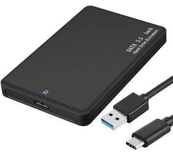

# 扩容到外置磁盘

一键将系统安装到外置磁盘，达到 1+N 或 2+N 的目的，  
从此任性地安装运行各种软件程序，不再怕空间不足啦！  

本功能目前只适配海思芯片的机顶盒！（玩客云s805暂不支持）  

## 1.获取一键安装脚本

在终端输入命令拉取安装脚本：

```bash
nasupdate
```


## 2.提前准备工作

- 你需要准备一个健康的优盘，或者 2.5寸 USB 硬盘盒 + 2.5寸硬盘（免独立供电）；  
- 或者一张正规的 TF 卡（请自行检查你的盒子是否支持卡槽和识别）;  
- 请务必检查你的电源适配器是否跟盒子型号相符！绝大多数是 12V1A , 恩兔是 5V2A;  
- 请务必保证你的设备运行环境的稳定性，避免易碰，易潮，易断电！

注意：TF 卡容量超过 128G 的，几乎是智商产品；  
注意：不建议使用超过 500G 的硬盘。  

 


## 3.执行安装命令

### 第1步 执行硬盘的分区和格式化命令

```
format-disk.sh
```
注意：如果你的硬盘存在多个分区，请执行多一次此命令。  
直到通过 `fdisk -l` 或者 `df -h` 观察结果完全符合大小。  

注意：格式化后，是Linux的ext4文件系统，Windows下是默认不识别内容的。  


## 4.使用注意事项


## 5.将来进化
