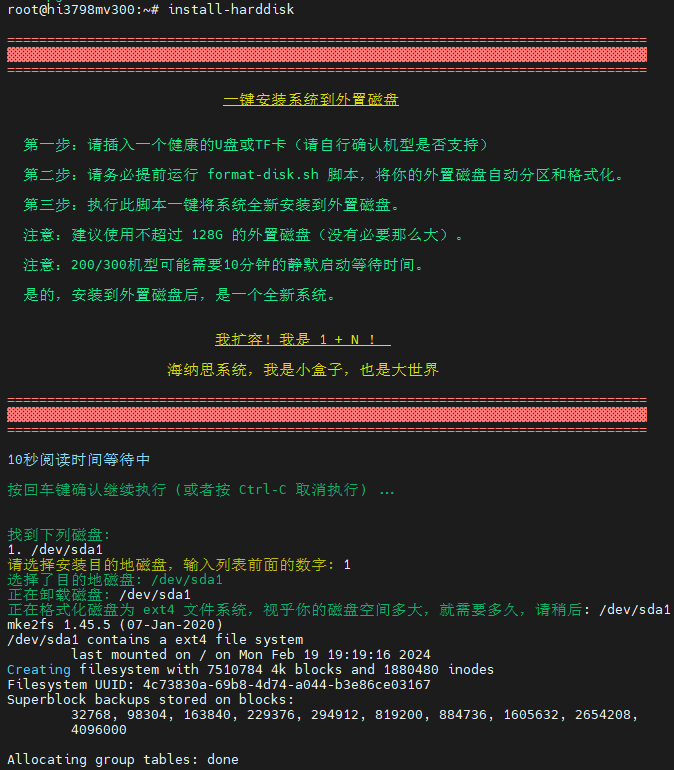

# 扩容到外置磁盘

一键将系统安装到外置磁盘，达到 1+N 或 2+N 的目的，  
从此任性地安装运行各种软件程序，不再怕空间不足啦！  

本功能目前只适配海思芯片的机顶盒！（玩客云s805暂不支持）  

## 1.获取一键安装脚本

在终端输入命令拉取安装脚本：

```bash
nasupdate
```


## 2.提前准备工作

- 你需要准备一个健康的优盘，或者 2.5寸 USB 硬盘盒 + 2.5寸硬盘（免独立供电）；  
- 或者一张正规的 TF 卡（请自行检查你的盒子是否支持卡槽和识别）;  
- 请务必检查你的电源适配器是否跟盒子型号相符！绝大多数是 12V1A , 恩兔是 5V2A;  
- 请务必保证你的设备运行环境的稳定性，避免易碰，易潮，易断电！

注意：TF 卡容量超过 128G 的，几乎是智商产品；  
注意：不建议使用超过 500G 的硬盘。  

 


## 3.执行安装命令

### 第1步 执行硬盘的分区和格式化命令

```
format-disk.sh
```
注意：如果你的硬盘存在多个分区，请执行多一次此命令。  
直到通过 `fdisk -l` 或者 `df -h` 观察结果完全符合大小。  

注意：格式化后，是 Linux 的 ext4 文件系统，Windows 下是默认不识别内容的。  


### 第2步 执行安装到外置磁盘的命令

```bash
install-harddisk
```

   
   


## 4.使用注意事项

扩容原理：  
1.你原来在 emmc 里的系统并没有改变。当然，如果你的原来的系统有挂载的，肯定就没了挂载的部分了。  
2.将外置磁盘代替第 9 分区的 rootfs 根目录系统；  
3.通过内置的备份包，将rootfs写到外置磁盘；  
4.通过改变启动，达到开机启动到外置磁盘；  
5.emmc 里的内核依然不变，仅仅将根目录安装到外置磁盘了。  
6.你可以通过 chgmac.sh 命令，切换启动到 emmc原系统，或者 usb 硬盘系统。  
7.扩容后，随便安装。但是一旦执行 recoverbackup，就会返回 emmc 系统，这个时候继续执行安装到硬盘即可。  
8.如果使用过程中硬盘被突然断电损坏，只能重新刷机。  

注意事项：  
- 保持长期通电，尽可能减少物理重启造成的磁盘坏道，特别是在高速读写过程中。  
- 作者测试机保持 100 多天稳定运行。所以无须担心稳定性。  
- 不健康的磁盘，有可能会在使用过程中卡顿或者程序出错。  
- 某些易驱线不一定支持Linux的，请改用正规大牌的易驱线。  
- 如果电源适配器不匹配，没有达到标准，可能造成供电不足无法识别硬盘。  


## 5.将来进化

关于拔掉外置磁盘就自动启动emmc系统，这个需要uboot的配合，尚在开发中。将来可能实现。