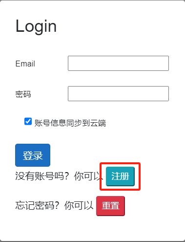
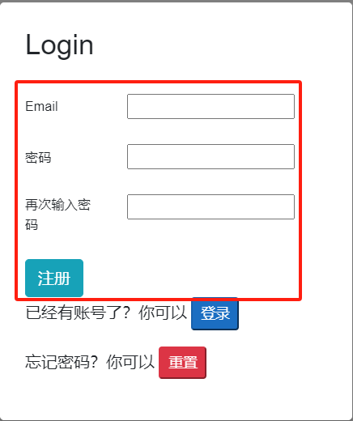
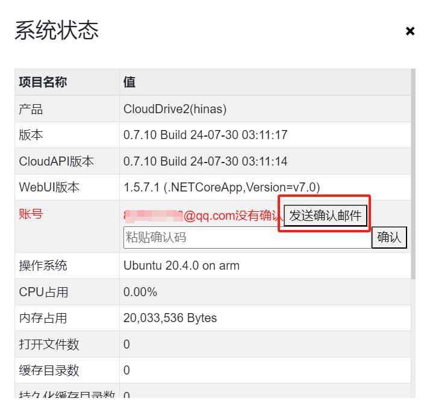
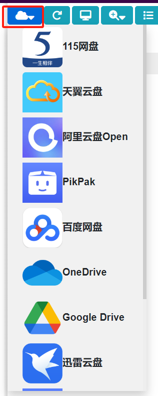

# clouddrive2

CloudDrive 是一个全方位的云存储管理平台  
详细介绍请自行阅读 CloudDrive 官网资料。

注意：该软件内有收费项目。本站仅仅简化安装方式，方便有需要的玩家。

该软件任何纠纷与责任与本站无关。

## 1.获取海纳思软件仓库的安装包

在终端输入命令拉取安装：

```bash
apt update
apt install clouddrive-histb
```


## 2.使用说明

安装后，刷新你的主页，在“局域网”页面内出现图标，点击进入即可。


## 3.卸载

在终端输入命令：

```bash
apt purge clouddrive-histb
```

## 4、注册账户



输入邮箱和密码注册（注意：请不要将密码设置成邮箱的登录密码）



输入刚刚的邮箱和密码登录

## 5、验证邮箱

点击图标 i


点击发送确认邮件



将验证码输入确认，完成邮箱验证。

## 6、添加网盘


选择要添加的网盘，根据页面提示操作即可。

注意：普通会员账号，网盘只能挂载两个。

## 7、注意事项

1. 上传限制单文件大小最大 10G，且上传过程看不到进度条，如果刷新网页或者关闭，上传任务就中断，不会自动续传。如果文件过大请耐心等待；
   通过自带的刷新按钮刷新，查看比对文件大小，确定文件是否完成上传。
   
2. 上传和下载都不可以在那个自带的任务里查看；
