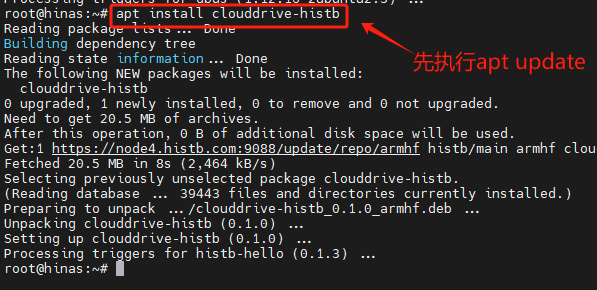
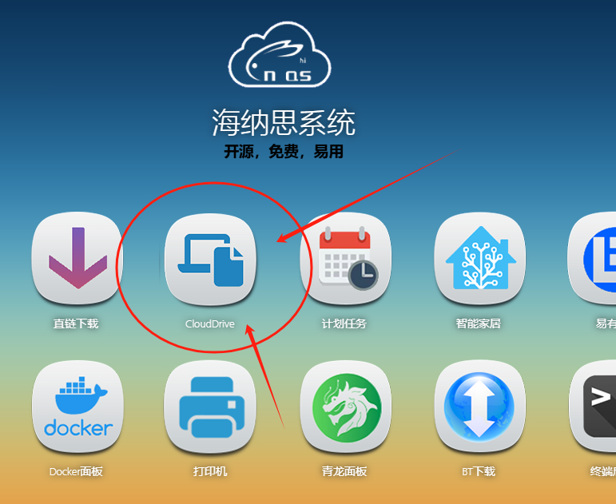

# clouddrive2安装

CloudDrive是一个全方位的云存储管理平台   
详细介绍请自行阅读CloudDrive官网资料。  

注意：该软件内有收费项目。本站仅仅简化安装方式，方便有需要的玩家。  

该软件任何纠纷与责任与本站无关。  


## 1.获取海纳思软件仓库的安装包

在终端输入命令拉取安装： 

```bash
apt update  
apt install clouddrive-histb  
```

 

## 2.使用说明

安装后，刷新你的主页，在“局域网”页面内出现图标，点击进入即可。  


 


## 3.卸载

在终端输入命令： 

```bash
apt purge clouddrive-histb  
```

