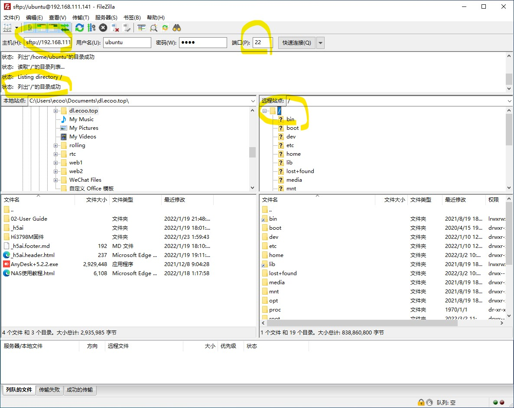
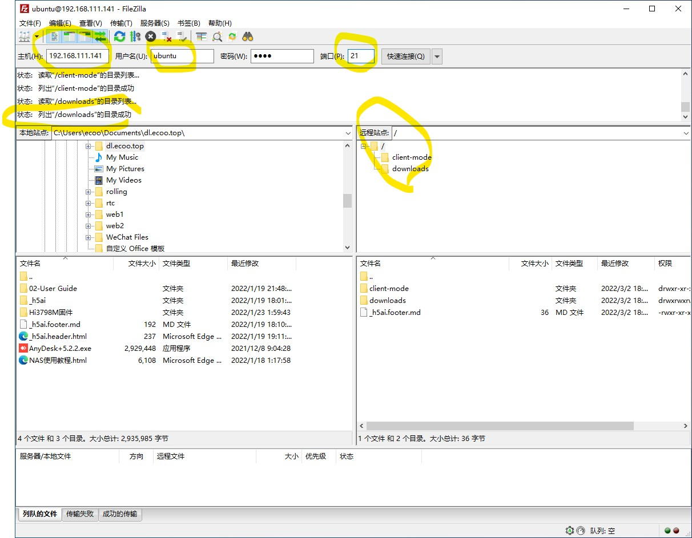

# 管理服务器文档

建议使用[FileZilla](https://www.filezilla.cn/download/client)或者[WinSCP](https://winscp.net/eng/download.php)进行文件传输管理

## 说明

NAS 系统已内置了 vsftpd 服务端, 可以使用 FTP 上传或下载软件, 同时也可以进行系统文件管理。

## 使用实例

请参考以下图例进行实际操作：

