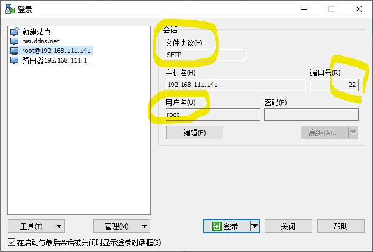
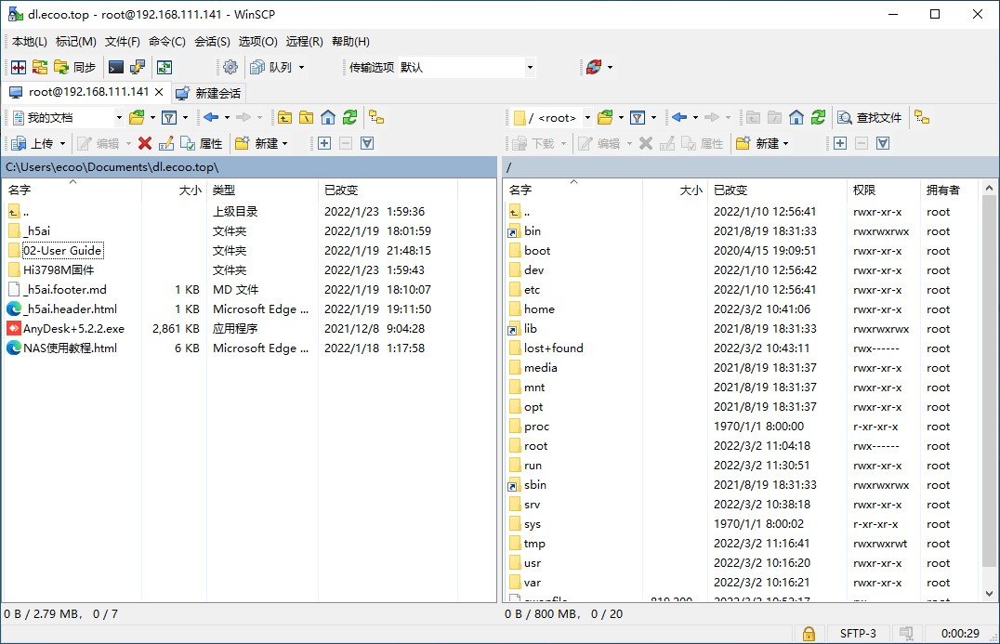

# MobaXterm 管理服务器

😀️ 建议使用 [MobaXterm](https://node2.histb.com/update/soft_init/MobaXterm.zip) 工具进行文件传输管理

## 说明

NAS 系统已内置了 vsftpd 服务端, 可以使用 FTP 上传或下载软件, 同时也可以进行系统文件管理。
用户名和密码跟随系统的用户名和密码。

:::tip
使用 sftp 操作，可以直达根目录。当然，也可以使用 `Alist` 或者其他程序比如 `可道云` 进行文档管理
:::

## 使用实例

请参考以下图例进行实际操作：

