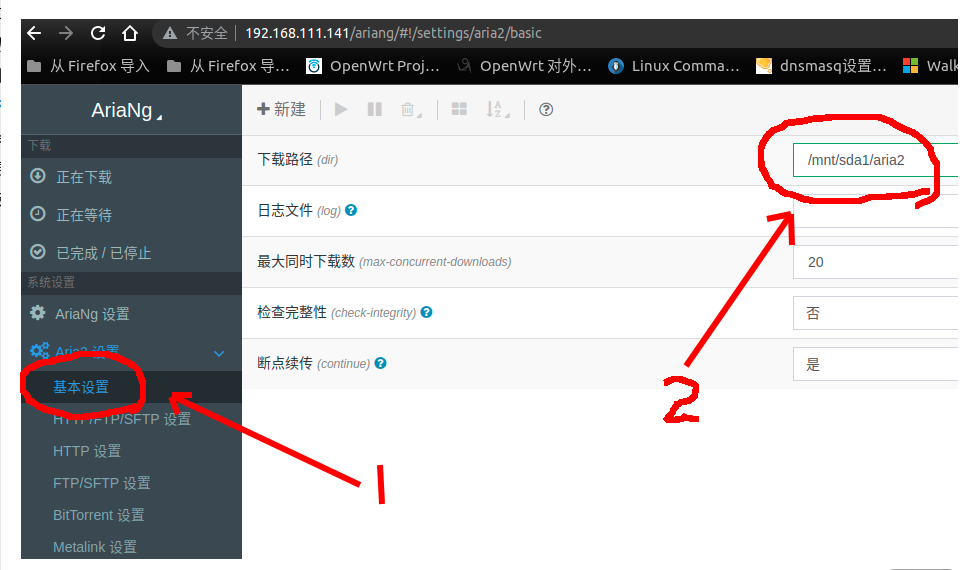
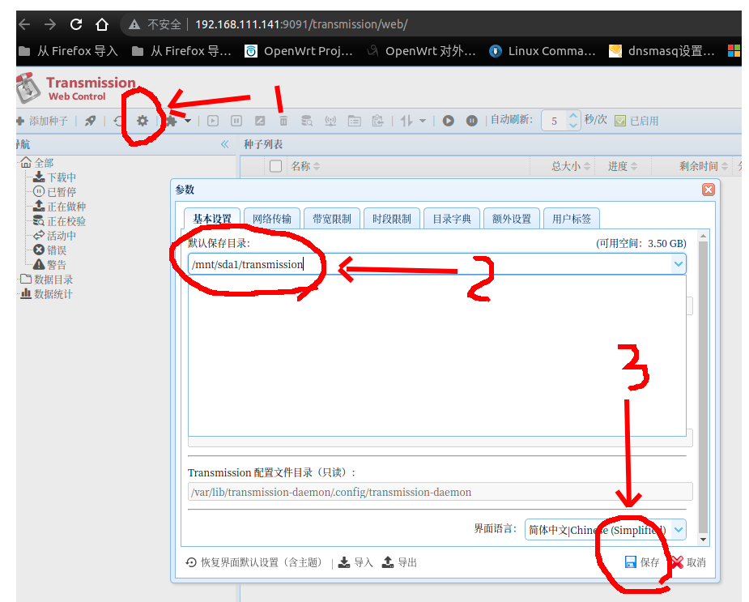

# 网络下载

海纳思系统提供了 aria2 和 transmission 两套下载管理器。

🌏️ 别说了，快上车，妥妥的一台网络下载机！

## aria2 使用

内置了 P3TER PRO 版的 aria2 下载软件，支持直连下载，BT 下载，磁力下载等。

默认下载目的地 `/home/ubuntu/downloads`

RPC 端口 `6800`

## 更新 Tracker 列表（提速）

终端输入命令可以更新最新的种子跟踪 tracker 列表

```bash
update-tracker.sh
#然后按提示操作
```

## 更改 aria2 配置

以下命令可以配置文件

```bash
vi /usr/local/aria2/aria2.conf
```

例如将下载位置修改到外挂磁盘位置：

将 `dir=/home/ubuntu/downloads` 修改为 `dir=/mnt/sda1/downloads`



## transmission 使用

默认登陆帐号 **_admin_** 密码 **_admin_**

这是一款优秀的种子文件下载器。

## 更改 transmission 配置

配置文件位置`/etc/transmission-daemon/settings.json`

密码修改方法：

```bash
# 停止 Transmission 服务
/etc/init.d/transmission-daemon stop
# 修改密码
# 编辑配置文件: vi /etc/transmission-daemon/settings.json
# 找到以下内容:
"rpc-password": "{1e82c73f8f4b5c3ba4e2d94227fc19dc3442abf7nSWuZtsb",
"rpc-port": 9091,
"rpc-url": "/transmission/",
"rpc-username": "admin",
# 只需要修改 password、username 后面 "" 内的内容即可
# 开启 Transmission 服务
/etc/init.d/transmission-daemon start
```

默认下载位置和修改下载位置，同上参考。



## 直接下载到电脑共享文件夹

打开文件管理器，新建文件夹 share，右键文件夹，点击属性，选择共享选项，点击共享按钮


设置共享用户，可以选择 Everyone 或者创建一个用于共享的账号，这里以账号”ZX“为例


修改权限级别为“读取/写入”，最后确认共享


windows 的设置到此为止，浏览器打开 hinas 的终端后台(设备 IP:7681)

```shell
#执行下面安装命令
sudo apt-get install cifs-utils
mkdir /mnt/share
#挂载windows共享的文件夹，将主机192.168.1.3共享的目录share挂载到/mnt/share
sudo mount -t cifs //192.168.1.3/share /mnt/share -o username=ZX,password=ZX,vers=2.0
```


最后按照上面的修改下载路径的方法，将路径改为/mnt/share 即可实现直接将下载的文件保存到 windows
