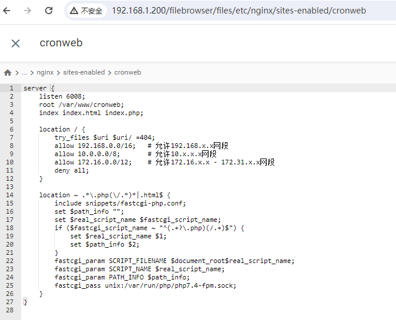

# 定时任务

优秀的 Linux crontab 任务管理器

## 使用基础

- 编辑任务管理器

```bash
crontab -e
```

- 浏览任务管理器

```bash
crontab -l
```

## 添加任务

- 实例 1：每 1 分钟执行一次 myCommand

```bash
* * * * * myCommand
```

- 实例 2：每晚的 21:30 重启 smb

```bash
30 21 * * * systemctl restart smbd
```

- 实例 3：每一小时重启 smb

```bash
0 */1 * * * systemctl restart smbd
```

## 常见问题

1. 无法访问，出现 403 Forbidden！
   情况：使用路由器 A 可以正常访问，但是把盒子更换位置连接路由器 B 访问就出现
   原因：A 路由器和 B 路由器的子网网段不同，一个处于 192.168.1.1，一个可以是 192.168.2.1 或其他
   解决方式：
   编辑文件"/etc/nginx/sites-enabled/cronweb"
   将内容由图 1 改成图 2
   
   
   将图 1 中的

```console
allow 192.168.1.0/24;
```

改为下面的内容，可以添加允许多个内网网段访问

```console
allow 192.168.0.0/16;   # 允许192.168.x.x网段
allow 10.0.0.0/8;       # 允许10.x.x.x网段
allow 172.16.0.0/12;    # 允许172.16.x.x - 172.31.x.x网段
```

保存重启 nginx,或者重载 nginx

```shell
#重启
systemctl restart nginx
#重载
nginx -s reload
```

## 学习教材

[www.runoob.com](https://www.runoob.com/w3cnote/linux-crontab-tasks.html)
