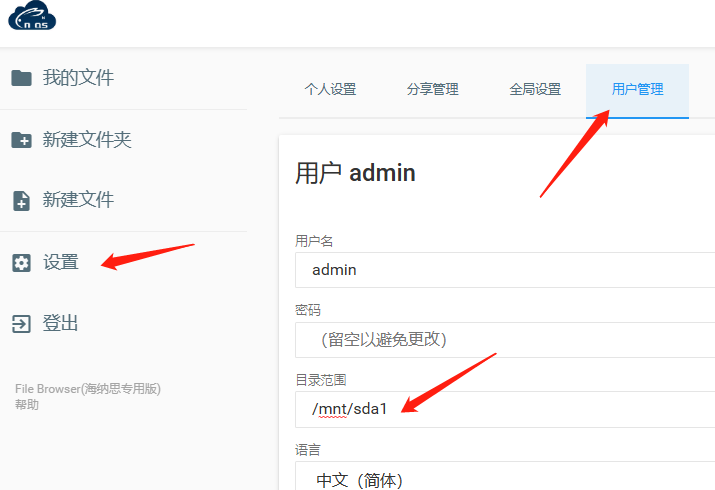

# 文件管理器 Filebrowser


默认登陆用户名和密码 **_admin_** **_admin_**

默认首页操作路径位置: /home/ubuntu/files  

如果要更改操作路径位置，请参考下图：  

设置--用户管理--编辑--目录范围（比如管理挂载盘/mnt/sda1）  




## 用户认证


> **`请注意，如果盒子存在外网访问需求的，强烈建议请勿关闭认证，文件管理器不仅可以上传、下载、编辑文件，还可以执行系统命令，造成的后果自负。`**


复制下面命令前往命令行窗口执行即可


1. 关闭

```shell
systemctl stop filebrowser
/opt/filebrowser/filebrowser config set --auth.method=noauth
systemctl start filebrowser
```

2. 开启

```shell
systemctl stop filebrowser
/opt/filebrowser/filebrowser config set --auth.method=json
systemctl start filebrowser
```


## 重置密码

```shell
systemctl stop filebrowser
cd /opt/filebrowser
#修改admin的密码为admin，命令：/opt/filebrowser/filebrowser users update [用户名] -p [新的密码]
/opt/filebrowser/filebrowser users update admin -p admin
systemctl start filebrowser
```


另外，建议这个文件管理器搭配 h5ai 做分享网盘系统，分享给家人的，和自己私密的文件进行分类，简直完美。

更多配置请自行前往 [filebrowser 官网](https://filebrowser.org/)查询

