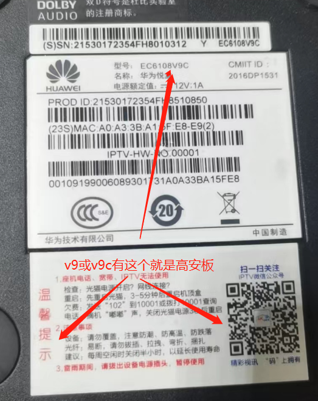
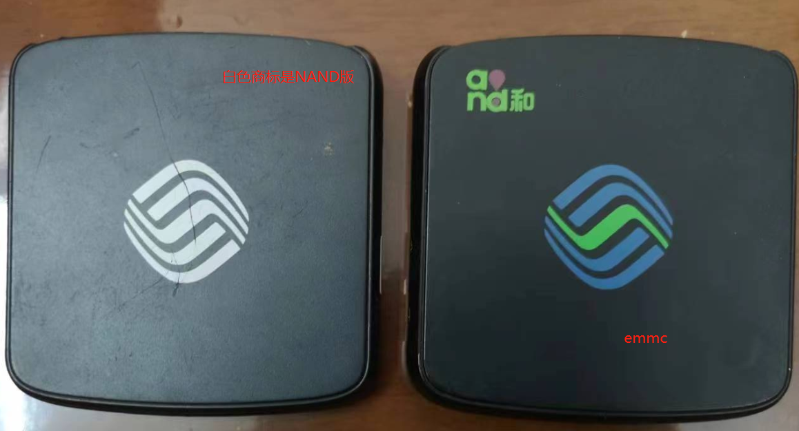

# 设备支持适配表（海思芯片机顶盒）

列表中未列明的，要么芯片未适配，要么没有厂家SDK，无须再提问。

hi3798mv300H，hi3798mv310尚在开发中，暂不适配。

| 厂商型号                                 | 芯片        | 运存 | 存储类型 | 存储容量 | fastboot/uboot简称    | 备注                         |
| ---------------------------------------- | ----------- | ---- | -------- | -------- | --------------------- | ---------------------------- |
| 华为悦盒ec6108v9c                        | hi3798mv100 | 1G   | emmc     | 8G       | mdmo1g                | 作者开发原型机               |
| 华为悦盒ec6108v9                         | hi3798mv100 | 1G   | emmc     | 4G       | mdmo1d                |                              |
| 华为MediaQ M330                          | hi3798mv100 | 1G   | emmc     | 4G       | mdmo1d                |                              |
| 江苏银河电子G2 40                        | hi3798mv100 | 1G   | emmc     | 8G       | mdmo1a                |                              |
| 华为荣耀M321                             | hi3798mv100 | 1G   | emmc     | 8G       | mdmo1a                |                              |
| 魔百盒(银河 G2 100B)                     | hi3798mv100 | 1G   | emmc     | 4G       | mdmo1f                |                              |
| 河北联通UT斯达康MC8638                   | hi3798mv100 | 1G   | emmc     | 8G       | mdmo1g                |                              |
| 长虹IHO-3000                             | hi3798mv100 | 1G   | emmc     | 8G       | mdmo1g                |                              |
| 海信YMB0310-HX                           | hi3798mv100 | 1G   | emmc     | 8G       | mdmo1g                |                              |
| 烽火hg680-j                              | hi3798mv100 | 1G   | emmc     | 8G       | mdmo1f                |                              |
| 创维e910                                 | hi3798mv100 | 768M | emmc     | 4G       | mdmo1f                |                              |
| 创维e900(usb3.0版）                      | hi3798mv100 | 1G   | emmc     | 4G       | mdmo1d                |                              |
| 创维e900                                 | hi3798mv100 | 1G   | emmc     | 4G       | mdmo1g                |                              |
| 创维E900-S                               | hi3798mv100 | 1G   | emmc     | 8G       | mdmo1c                |                              |
| 魔百盒cm101s                             | hi3798mv100 | 1G   | emmc     | 8G       | mdmo1g                |                              |
| 魔百盒cm101s-2~                          | hi3798mv100 | 1G   | emmc     | 8G       | mdmo1g                |                              |
| 华为悦盒ec6109-u/m                       | hi3798mv200 | 1G   | emmc     | 4G       | mv2dma                |                              |
| 华为Q21                                  | hi3798mv200 | 1G   | emmc     | 8G       | mv2dma                |                              |
| 福建广电网络智能4K                       | hi3798mv200 | 1G   | emmc     | 8G       | mv2dma                | hc2910                       |
| 歌华hc2910                               | hi3798mv200 | 2G   | emmc     | 8G       | mv2dmb mv2dmf         |                              |
| 内蒙广电机顶盒MR2505C                    | hi3798mv200 | 1G   | emmc     | 8G       | mv2dmc                |                              |
| 内蒙广电创维hc2910                       | hi3798mv200 | 2G   | emmc     | 8G       | mv2dmc                |                              |
| 河北广电HC2910 E家亲  湖北广电HC2910 E家亲 | hi3798mv200 | 2G   | emmc     | 8G       | mv2dmg  mv2dmf        | 注意部分可能需要硬改网口     |
| 广电云盒极速版DVC-8178 CW                | hi3798mv200 | 1G   | emmc     | 8G       | mv2dmd                |                              |
| 移动新魔百和M301H(CW,SM代工的盒子可以)   | hi3798mv300 | 1G   | emmc     | 8G       | mv3dmw mv3dms1 mv3dma   | 2018之前的是mv300注意盲盒    |
| 魔百盒CM201-2                            | hi3798mv300 | 1G   | emmc     | 8G       | mv3dms1 mv3dmm mv3dmf | 大量盲盒，不推荐NAND版不能刷 |
| 九联-UNT400B                             | hi3798mv100 | 1G   | emmc     | 8G       | mdmo1c                |                              |
| 魔百盒-UNT400C                           | hi3798mv100 | 1G   | emmc     | 8G       | mdmo1a                |  群友反馈                     |
| 临沂创维E900S                            | hi3798mv100 | 768M | emmc     | 8G       | mdmo1d                |                              |
| 魔百盒CM301                            | hi3798mv300 | 2G | emmc     | 8G       | mv3dmf                |                              |

另外可以到论坛参考热心网友收集的各种可刷机盒子型号和注意事项。
:::tip
高安版，NAND存储芯片无法适配刷机
:::

# 如何分辨高安板（例子）

1.使用TTL串口连接盒子，串口终端显示如下图信息分辨：

2.四川地区，上海地区，河北地区的盒子，多数为高安版，以下图例参考分辨：

