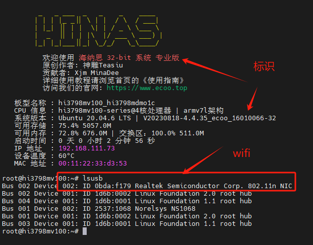
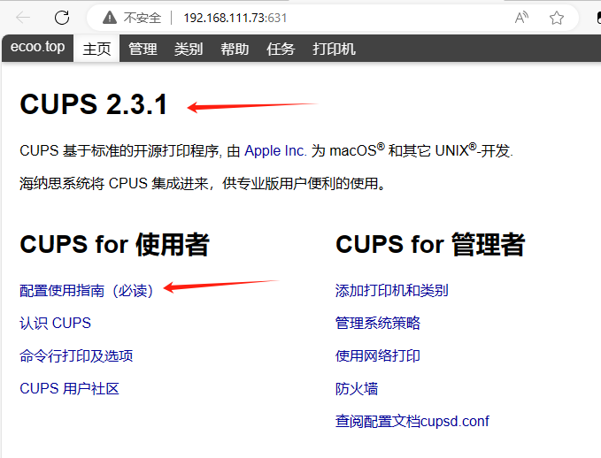
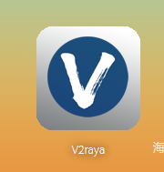
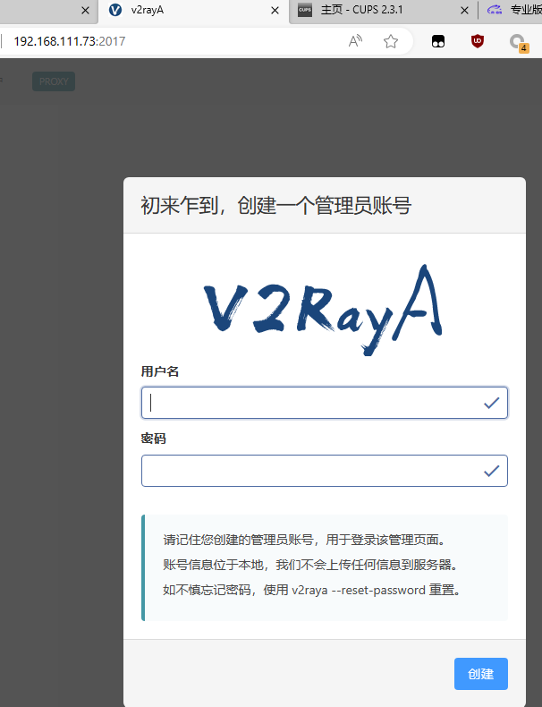

# 专业版功能介绍

开发者为您奉上更加专业需求的功能；  

特别说明：  
目前仅以下CPU机型适配升级专业版  
hi3798Mv100  
hi3798Mv200  
hi3798Mv200恩兔N2  

:::tip
专业版采用的是绑定 CPU “唯一设备识别码” 定制的固件，  
每台机器的设备识别码都是固定且唯一的；  
无论多次重刷社区版或其它专用固件，均可一句命令 `vipupgrade` 升级切换到专业版;  
作者服务器提供永久升级。

:::


## 增加功能（社区版对比）

与社区版对比。增加如下功能：  
### 1.wifi使用（部分机型） 

hi3798Mv100：除极少部分盒子（厂家阉割）外，90%的都支持wifi驱动；  

hi3798Mv200：目前测试仅N71和hc2910的大百盒发现支持的wifi；  

  


### 2.Linux Cups 打印服务系统

内置linux cups开源打印服务程序和开源驱动；  

免除自行折腾安装的烦恼；  

配置方法和适配打印机，请自行搜索 “linux cups 支持打印机” “linux cups 使用教程”  

  
   

### 3.首页去掉广告图片


### 4.赠送内网穿透 1 年使用权

默认穿透首页80端口，无论你是否在什么网络环境下，只要能连互联网，即可外网直达访问盒子首页；  
采用frpc的穿透程序；  
国外服务器，晚高峰和部分地区稍慢；  

:::tip
已开通的用户任何时候（刷机或重置后）终端输入 :  
```bash
nasupdate
kaitong-frp
```

即可重新复通。

:::

### 5.内置v2raya程序

这是一个内置的科学联网程序，这是一个公开的开源程序，使用方法自行百度摸索学习。  
禁止用于非法用途！

   
 

## 购买专业版

- 升级到专业版（40元）  
- 注意，目前仅支持mv100/mv200通用机型；  
- 终端输入 nasupdate ；  
- 接着输入 histb ；  
- 将会得到一个机顶盒识别码，将此码复制后发给群主；  
- 制作开通后，一键命令 vipupgrade 升级即可。  

