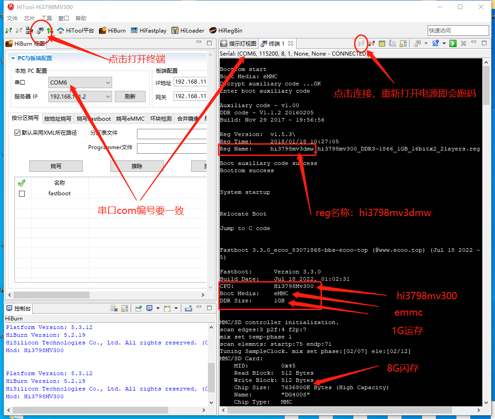

# 设备管脚配置名称（海思芯片机顶盒）

## 一、什么叫做 reg 名称

reg 是海思 SDK 里对 fastboot 代码的表格配置文件名称，也叫做“管脚配置表”。  
表格中的内容全是寄存器的配置，主要涉及单板硬件关键参数说明、PLL、DDR、外设时钟、管脚复用、网口配置等。  
我们来看两个例子：  
比如 Hi3798Mv100 (华为悦盒 ec6108v9c 型号)的 reg 名称是：  

hi3798mdmo1g_hi3798mv100_ddr3_1gbyte_16bitx2_4layers_emmc.reg  

比如 Hi3798Mv200 (恩兔 n2ns1、n2c)的 reg 名称是：  

hi3798mv2dmc_hi3798mv200_DDR4-2133_2GB_16bitx2_4layers_emmc.reg  

我们从上面的名称可以判断这个板子的 CPU、DDR、闪存类型、pbc板层数等信息。  
这样，我们就可以轻易的对照自己的机顶盒判断选择适合刷入对应的神雕开发固件了。  

## 二、获取 reg 名称的四种常用方法

### 1.串口跑码读取参数
利用串口读写器 TTL 读取。或详细参考[TTL线刷教程](/docs/tutorial-basics/ttl-flash)  
把 usb 转 ttl 小板插入电脑，用杜邦线和针脚连接到板子的 GDN、TX、RX，  
使用串口终端跑码读取 fastboot 的参数，如下图：  

### 2.